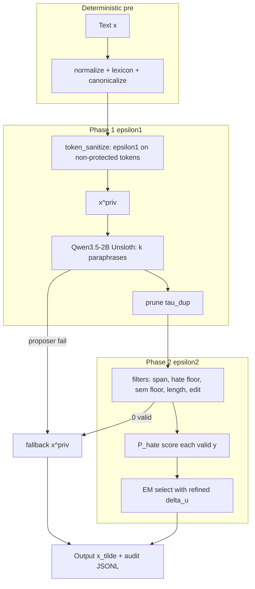
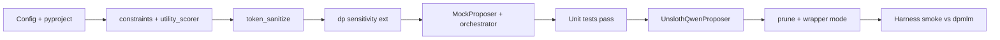

# Minimum EM-HSD 2.0 Implementation Plan

## Goal

End-to-end proof that Layer-4-only **EM-HSD 2.0** works on PrivHSD CSVs:

```bash
python -m wrapper.run --in dev.csv --out dev_private.csv --mode em-hsd-v2 --config configs/em-hsd-v2.yaml
python -m harness.evaluate --original dev.csv --privatized dev_private.csv --config configs/em-hsd-v2.yaml --utility-backend hf
```

Compare **TO** vs existing `--mode dpmlm` baseline on the same dev split.

**Scope:** Full v2 per [layer-04-only-proposal-v2.md](TRIAGE-DP/layer-04-only-proposal-v2.md) — **excluding** §15 adaptive prompts, RS-SFT, and `harness/calibrate_em.py` (defer until core loop passes).

**Paraphraser:** `unsloth/Qwen3.5-2B` (4-bit), user-selected 2B size.

---

## What already exists (reuse, do not rewrite)

| Asset | Path | Use |
|-------|------|-----|
| EM selection | [`stretch/candidate_selection.py`](Johnny%20t0-1.03/src/stretch/candidate_selection.py) | Phase 2 ε₂ pick |
| DP math | [`mechanism/dp.py`](Johnny%20t0-1.03/src/mechanism/dp.py) | ε₁ per-token + ε₂ selection |
| Preprocessing | [`mechanism/normalize.py`](Johnny%20t0-1.03/src/mechanism/normalize.py), [`lexicon.py`](Johnny%20t0-1.03/src/mechanism/lexicon.py), [`canonicalize.py`](Johnny%20t0-1.03/src/mechanism/canonicalize.py), [`tokenize.py`](Johnny%20t0-1.03/src/mechanism/tokenize.py) | Protected spans + normalize |
| MLM backend | [`mechanism/mlm.py`](Johnny%20t0-1.03/src/mechanism/mlm.py) | ε₁ token candidates (distilroberta or hash for tests) |
| Harness | [`harness/evaluate.py`](Johnny%20t0-1.03/src/harness/evaluate.py) | TO / F1 / re-ID |
| Wrapper | [`wrapper/run.py`](Johnny%20t0-1.03/src/wrapper/run.py) | CSV I/O, per-row RNG, diff check |
| Synthetic dev | [`data/synthetic_dev.csv`](Johnny%20t0-1.03/data/synthetic_dev.csv) | First integration rows |

**Gap:** `pyproject.toml` is missing from the workspace (only `egg-info` remains). Restore packaging as part of this work.

---

## Architecture



**Privacy budget:** `epsilon_1 = epsilon_2 = epsilon_total * epsilon_split` (default split 0.5). Audit log records both + `epsilon_total`.

**Boundary rules (preserve existing tests):**
- Mechanism/stretch never imports `harness` or `wrapper`
- `privatize_em_hsd_v2(text, config)` receives **Text only** + `config.rng`

---

## New modules to build

### 1. Config — `EmHsdV2Config` in [`mechanism/config.py`](Johnny%20t0-1.03/src/mechanism/config.py)

Add YAML section `em_hsd_v2:` matching spec §6:

```yaml
em_hsd_v2:
  epsilon_total: 18.0
  epsilon_split: 0.5
  k_generate: 6
  k_max_after_prune: 4
  tau_dup: 0.80
  token_sanitize_top_m: 32
  generation_temperature: 0.9
  hate_floor_delta: 0.05
  tau_sem_min: 0.55
  min_edit_ratio: 0.08
  clip: 5.0
  use_refined_delta_u: true

generation:
  backend: unsloth          # unsloth | mock (tests)
  model: unsloth/Qwen3.5-2B
  load_in_4bit: true
  max_new_tokens: 256

embedding:
  model: sentence-transformers/all-MiniLM-L6-v2   # prune + sem floor + token neighbors
```

New config file: [`configs/em-hsd-v2.yaml`](Johnny%20t0-1.03/configs/em-hsd-v2.yaml)  
Test config: [`configs/em-hsd-v2-test.yaml`](Johnny%20t0-1.03/configs/em-hsd-v2-test.yaml) with `generation.backend: mock` and `mlm.backend: hash`.

### 2. Token sanitize — [`stretch/token_sanitize.py`](Johnny%20t0-1.03/src/stretch/token_sanitize.py)

Extract logic from [`spine.privatize`](Johnny%20t0-1.03/src/mechanism/spine.py) into a dedicated path:

- Run steps 1–4 (segment, normalize, canonicalize protected)
- For **content** tokens only: DP rewrite with fixed **ε₁** via existing `mlm` backend + `dp.select`
- Skip **PROTECTED**, URL, MENTION, HASHTAG (per v2 §4.2)
- Return `(x_priv, token_log_phase1)`

Reuse `get_resources(config)` for lexicon + MLM; do **not** duplicate segmentation code.

### 3. Qwen proposer — [`stretch/generative_proposer.py`](Johnny%20t0-1.03/src/stretch/generative_proposer.py)

**`UnslothQwenProposer`** (implements `GenerativeProposer`):

```python
from unsloth import FastLanguageModel

model, tokenizer = FastLanguageModel.from_pretrained(
    model_name=config.generation.model,   # unsloth/Qwen3.5-2B
    max_seq_length=2048,
    load_in_4bit=config.generation.load_in_4bit,
)
FastLanguageModel.for_inference(model)
```

- **Singleton loader** cached on config (same pattern as `get_resources`)
- Prompt from v2 §4.3 with `{protected_list}` filled from lexicon hits on `x_priv`
- **k diversity:** loop `k_generate` times; seed `rng.integers(2**31)` per sample; `temperature` from config
- Use `tokenizer.apply_chat_template(..., add_generation_prompt=True)` for instruct formatting
- **`MockProposer`:** returns hand-crafted string variants for unit tests (no GPU)

Replace [`NotImplementedProposer`](Johnny%20t0-1.03/src/stretch/candidate_selection.py) as default in production config only; keep it for explicit scaffold tests.

### 4. Prune — [`stretch/prune_candidates.py`](Johnny%20t0-1.03/src/stretch/prune_candidates.py)

- Encode candidates with MiniLM (cached encoder)
- Greedy keep: start from highest-index diversity, drop pairs with cos ≥ `tau_dup`
- Cap at `k_max_after_prune`

### 5. Filters + scorer — [`stretch/constraints.py`](Johnny%20t0-1.03/src/stretch/constraints.py), [`stretch/utility_scorer.py`](Johnny%20t0-1.03/src/stretch/utility_scorer.py)

**`filter_candidates(candidates, x, x_priv, protected_skels, config, scorer, encoder)`** returns `(valid, reject_reasons[])`.

| Filter | Implementation |
|--------|----------------|
| Span preservation | Reuse lexicon skeleton match (mirror harness proxy logic locally — **do not import harness**) |
| Hate floor δ | `P_hate(y) >= P_hate(x) - delta` |
| Semantic floor | `cos(encoder(x), encoder(y)) >= tau_sem_min` |
| Length | char ratio 0.4–2.5 |
| Min edit | normalized Levenshtein ratio ≥ `min_edit_ratio` |

**`HateUtilityScorer`:** duplicate probability extraction from [`HFHateClassifier`](Johnny%20t0-1.03/src/harness/classifiers.py) into stretch (add `score(text) -> float` returning hate probability, not binary). Default model: `cardiffnlp/twitter-roberta-base-hate-latest`. **`ProxyHateScorer`** for fast tests using lexicon keyword hit rate.

### 6. Refined Δu — [`stretch/sensitivity.py`](Johnny%20t0-1.03/src/stretch/sensitivity.py)

Per v2 §5.3:

```python
def refined_delta_u(text: str) -> float:
    L = max(1, len(tokenize_words(text)))
    return min(1.0, 2.0 / L)
```

**Extend [`mechanism/dp.py`](Johnny%20t0-1.03/src/mechanism/dp.py):** add optional `sensitivity: float | None` to `select_index` / `select` (default `2*clip` for backward compatibility). Phase 2 calls with `sensitivity=refined_delta_u(x)` when `use_refined_delta_u: true`; else naive `sensitivity=1.0` ablation path.

Scores are already in [0,1] — clip with `clip=1.0` for Phase 2 EM (distinct from MLM `clip=5.0` used in Phase 1).

### 7. Orchestrator — [`stretch/em_hsd_v2.py`](Johnny%20t0-1.03/src/stretch/em_hsd_v2.py)

Public API:

```python
def privatize_em_hsd_v2(text: str, config: Config) -> tuple[str, dict]:
    """Returns (output_text, audit_dict)."""
```

Pipeline:
1. `x_priv, log1 = token_sanitize(text, config, epsilon_1)`
2. `candidates = proposer.propose(x_priv, k_generate)` — catch errors → fallback
3. `candidates = prune(candidates, config)`
4. `valid, audit = filter_and_score(candidates, x, x_priv, ...)`
5. Branch per §5.5:
   - ≥2 valid → `select_rewrite(valid, scores, epsilon_2, clip=1.0, sensitivity=delta_u, rng)`
   - 1 valid → return it
   - 0 valid / proposer fail → return `x_priv`
6. Audit dict: candidates, scores, reject reasons, epsilons, fallback flag, `delta_u`

Export from [`stretch/__init__.py`](Johnny%20t0-1.03/src/stretch/__init__.py) and [`mechanism/__init__.py`](Johnny%20t0-1.03/src/mechanism/__init__.py) as optional re-export for wrapper.

### 8. Wrapper integration — [`wrapper/run.py`](Johnny%20t0-1.03/src/wrapper/run.py)

- Add `em-hsd-v2` to `MODES`
- On this mode: load resources once (`get_resources` + Qwen proposer + hate scorer + encoder)
- Per row: `config.rng = make_row_rng(...)` → `privatize_em_hsd_v2(text, config)`
- Log **sentence-level** JSONL (not token log): `{row, mode, audit}` to `<out>.log.jsonl`
- Skip SPINE MLM resource init if not needed for ε₁ when `mlm.backend: hash` in tests

---

## Dependencies and environment

Restore [`pyproject.toml`](Johnny%20t0-1.03/pyproject.toml) with extras:

| Extra | Packages |
|-------|----------|
| `hf` | `torch`, `transformers`, `sentence-transformers` |
| `emhsd` | `unsloth` (install per [Unsloth Qwen3.5 docs](https://unsloth.ai/docs/models/qwen3.5)) |
| `test` | `pytest` |

**Install target:**

```bash
pip install -e ".[hf,emhsd,test]"
```

**Hardware:** Qwen3.5-2B 4-bit ≈ 2–3 GB VRAM; CPU fallback only for mock backend.

**Model setup script:** extend [`scripts/setup_models.py`](Johnny%20t0-1.03/scripts/setup_models.py) to pre-download Qwen3.5-2B + hate classifier + MiniLM.

---

## Testing strategy

### Unit tests (no GPU) — [`tests/test_em_hsd_v2.py`](Johnny%20t0-1.03/tests/test_em_hsd_v2.py)

1. **MockProposer** + **ProxyHateScorer** + `hash` MLM → full pipeline returns non-empty text
2. Filters reject candidate missing protected span
3. Fallback returns `x_priv` when all candidates fail hate floor
4. `refined_delta_u` shorter text → larger sensitivity effect on EM (statistical test like existing stretch tests)
5. Author isolation: stretch does not import harness (extend existing test if needed)

### Integration test (GPU, optional marker `@pytest.mark.gpu`)

- 3 rows from `synthetic_dev.csv` with real Unsloth proposer
- Assert: output ≠ input for at least one hate row; protected terms preserved; audit log has `k_valid >= 0`

### Functional validation (manual)

```bash
# Baselines
python -m wrapper.run --in data/synthetic_dev.csv --out /tmp/id.csv --mode identity --config configs/em-hsd-v2-test.yaml
python -m wrapper.run --in data/synthetic_dev.csv --out /tmp/dp.csv --mode dpmlm --config configs/default.yaml

# EM-HSD v2
python -m wrapper.run --in data/synthetic_dev.csv --out /tmp/em.csv --mode em-hsd-v2 --config configs/em-hsd-v2.yaml

python -m harness.evaluate --original data/synthetic_dev.csv --privatized /tmp/em.csv --config configs/em-hsd-v2.yaml --utility-backend hf
```

**Success criteria (functional, not submission-grade):**
- Pipeline completes without error on full synthetic dev
- Valid-candidate rate > 0 on hate rows
- TO ≥ dpmlm on synthetic dev **or** clear diagnostic (e.g. all fallbacks → tune δ / prompt / temperature)

---

## Implementation order



Build **orchestrator + mock proposer first** so logic is testable before GPU work. Wire Unsloth last.

---

## Explicitly out of scope (this MVP)

- §15 GEPA / adaptive prompts
- Rejection-sampling SFT
- `harness/calibrate_em.py` grid search
- Layer 1–3 triage (occlusion, Biber, θ optimizer)
- Hard-row gate (`is_hard`) — v2 runs all rows

---

## Risks and mitigations

| Risk | Mitigation |
|------|------------|
| Unsloth install / CUDA mismatch | Mock backend for CI; document CUDA version; optional Docker note in README |
| Qwen ignores “keep insults” | Tighten prompt; lower temperature; rely on hate-floor filter + fallback to x^priv |
| All candidates filtered → always x^priv | Log `reject` reasons in audit; tune δ and τ_sem_min on dev |
| Slow on long posts | k=4, max_new_tokens=256, batch only if Unsloth supports it later |
| ε₁ slow (per-token MLM) | Accept for MVP; optional `fast.yaml` with higher ε₁ skip rate later |
