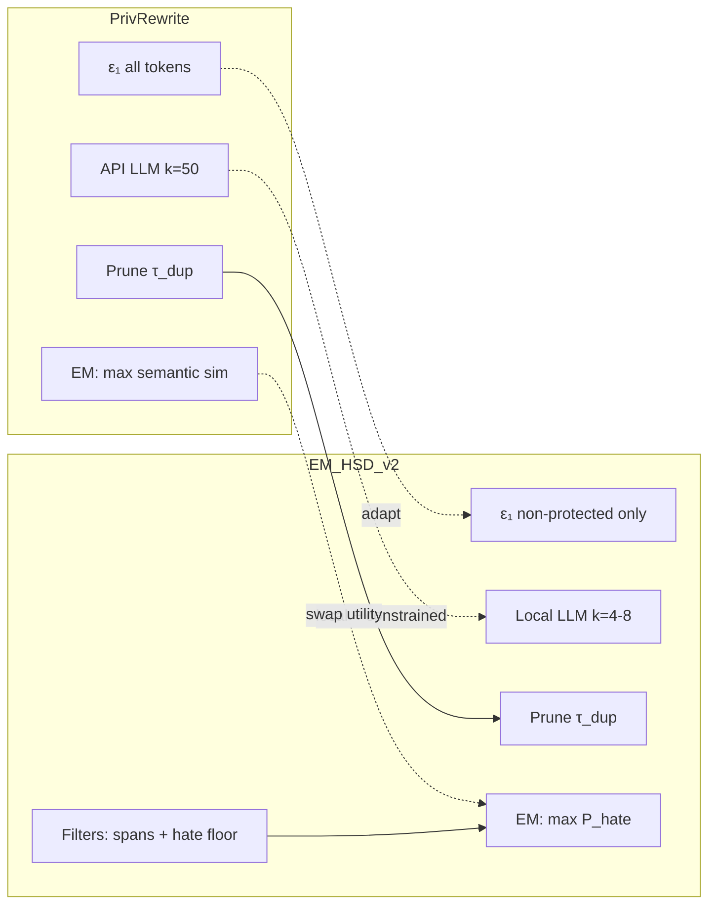

EM-HSD 2.0 (v2) is deliberately **PrivRewrite-shaped**: it keeps the two-phase DP skeleton and adapts almost everything else to **Identity-Agnostic Hate Speech Detection (IA-HSD)** on PrivHSD. v2’s own framing is: **PrivRewrite’s structure + IA-HSD utility + local deployment**.

---

## What v2 keeps from PrivRewrite (and why)

These are direct borrowings because they work well for end-to-end DP text rewriting:

| PrivRewrite component | v2 adoption | Reasoning |
|----------------------|-------------|-----------|
| **Two-phase pipeline** | Phase 1: ε₁ sanitize → k paraphrases → prune; Phase 2: EM select | Proven composition: **(ε₁ + ε₂)-DP** (PrivRewrite Theorem 1) |
| **Token-level adjacency** | Same neighbor definition (≤1 token differs) | Matches token sanitizer; standard local-DP text setting |
| **ε₁ token sanitization** | Exponential mechanism over embedding neighbors | Breaks stylometry before paraphrase; provider never sees raw text |
| **Paraphrase from x^priv** | LLM input is sanitized view, not raw x | Post-processing of ε₁ output — no extra budget |
| **Near-duplicate pruning** (τ_dup ≈ 0.8) | Same greedy τ_dup-separated subset | Redundant candidates weaken EM; diversity improves selection |
| **Refined Δu** + naive ablation | EM-HSD-Naive (Δu=1) vs refined bound | Less EM noise → better utility at same ε₂ |
| **Fallback to x^priv** | When 0 valid candidates or proposer fails | Still ε₁-DP; avoids releasing garbage (PrivRewrite §4.3.2) |
| **ε split** | Default ε₁ = ε₂ = ε_total / 2 | PrivRewrite experiments show balanced split is most stable |

v2 treats PrivRewrite as the **formal DP backbone** — the part that was weak in EM-HSD v1 (“selection-only DP”).

---

## What v2 changes (and why)

### 1. Black-box API LLM → local open-weight model

| PrivRewrite | EM-HSD 2.0 |
|-------------|------------|
| Gemini-2.0-Flash via **commercial API** | **FLAN-T5-base** (or Pegasus), pinned, CPU-viable |

**Reasoning:** PrivRewrite optimizes for “realistic API deployment.” PrivHSD optimizes for **human rights and reproducibility**: no closed API, no sending sensitive text to a provider, hackathon must run locally. v2 keeps the *idea* that the model only sees x^priv, but runs inference on your machine.

---

### 2. Semantic similarity as primary utility → hate classifier as primary utility

| PrivRewrite Phase 2 | EM-HSD 2.0 Phase 2 |
|---------------------|-------------------|
| **Maximize** SBERT-style semantic alignment: u_x(y) = clip(cosine(φ(x), φ(y))) | **Maximize** P_hate(y); semantic similarity is only a **floor** τ_sem_min |

**Reasoning:** PrivRewrite’s goal is **preserve meaning** (MedQuAD Q&A, IMDB sentiment). PrivHSD’s goal is **preserve hate-detection signal while breaking authorship**. Those are not the same:

- Semantic paraphrase can **soften or remove insults** while staying “similar” — exactly what the organizer case study showed (naive GPT, TO ≈ −0.36).
- v2 optimizes the **task utility** the competition scores (macro-F1), not ROUGE/SBERT-Cos.
- τ_sem_min blocks nonsense/empty rewrites without making “stay similar” the objective (PrivRewrite’s failure mode for moderation).

**Planned proof:** ablation **A6 (semantic-only EM)** — if it hurts TO, that validates the design for judges and the paper.

---

### 3. ε₁ on all tokens → selective ε₁ (skip protected hate spans)

| PrivRewrite | EM-HSD 2.0 |
|-------------|------------|
| Every token position sanitized independently | **Protected hate spans excluded** from ε₁; only canonicalized/frozen |

**Reasoning:** Hate signal is often **span-local** (slurs, insults). Token noise on those spans destroys moderation utility — the core PrivHSD trade-off. Skipping them is an explicit **utility policy** (documented limitation in v2 §9): stronger HSD preservation, weaker story for uniform token-level DP on hate tokens.

---

### 4. No task constraints → hard filters before EM

PrivRewrite relies on semantic utility + EM. v2 adds **hard gates**:

| Filter | Role |
|--------|------|
| **Span preservation** | Protected canonical skeleton must appear in candidate |
| **Hate floor δ** | P_hate(y) ≥ P_hate(x) − δ |
| **Semantic floor** | SBERT-Cos(y, x) ≥ τ_sem_min (constraint only) |
| **Length / min edit** | Stability + force stylometric change |

**Reasoning:** PrivRewrite assumes a strong API LLM will produce coherent, meaning-preserving candidates. A **small local model** plus a **hate-preservation task** needs explicit constraints so the EM pool cannot select “fluent but de-hated” rewrites. Constraints encode IA-HSD; EM adds DP on top.

---

### 5. k = 10–50 (default 50) → k = 4–8

| PrivRewrite | EM-HSD 2.0 |
|-------------|------------|
| k up to 50; more k → better SBERT-Cos | Generate ~6, prune to ~4 |

**Reasoning:** PrivRewrite targets **offline publishing** with API latency cost acceptable at scale. v2 targets **hackathon CPU budget** and grid calibration on dev. v2 still uses pruning so a small k stays diverse — PrivRewrite’s insight without PrivRewrite’s compute.

---

### 6. Refined Δu for semantic embeddings → approximate Δu for hate classifier

| PrivRewrite | EM-HSD 2.0 |
|-------------|------------|
| Lemma 1: Δu ≤ min(1, **2/(Tρ)**) for **semantic** u, with smoothing ρ | Δu ≤ min(1, **2/L**) for **P_hate**, assuming Lipschitz logits |

**Reasoning:** You cannot plug PrivRewrite’s Lemma 1 in unchanged — the utility function changed. v2 keeps the **same idea** (tight bound beats Δu=1) but re-derives for a **neural hate scorer**, with **EM-HSD-Naive** as the PrivRewrite-Naive analogue. The bound is acknowledged as approximate (v2 §14).

---

### 7. Evaluation and privacy budget scale

| PrivRewrite | EM-HSD 2.0 |
|-------------|------------|
| MedQuAD + IMDB; **SBERT-Cos, BERTScore** | Reddit-style PrivHSD; **TO, macro-F1, re-ID top-1** |
| ε ∈ {0.25 … 4.0} | ε_total ≈ 6–36 (default ~20), aligned with dpmlm/v1 scale |

**Reasoning:** Different problem and benchmark. PrivHSD’s **TO** explicitly balances utility ratio vs privacy ratio. Higher ε ranges match the competition setting, not PrivRewrite’s tight academic ε sweep.

---

### 8. Constrained paraphrase prompting (v2-specific)

PrivRewrite uses sanitized input + randomized prompting for diversity. v2 adds an explicit **IA-HSD prompt**:

- Keep protected terms in meaning  
- Do **not** remove insults or soften offense  
- Change openers, tics, distinctive phrasing  

**Reasoning:** Weaker local models need stronger task conditioning. This targets **stylometric privacy** (phrase-level fingerprints) without the GPT-style “helpful rewrite” that kills hate signal.

---

### 9. Optional adaptive prompt layer (§15) — not in PrivRewrite

v2 adds **offline** Loiseau-style prompt optimization (GEPA/grid) as optional — optimizes **how** the LLM rewrites, while **ε₁ + ε₂** stay the formal DP mechanisms.

**Reasoning:** PrivRewrite doesn’t address task-conditioned prompt brittleness. Loiseau does, but without ε-DP — v2 combines both: **PrivRewrite mechanisms + Loiseau instructions**.

---

## Design logic in one diagram

---

## Summary table

| Dimension | PrivRewrite | EM-HSD 2.0 | Why changed |
|-----------|-------------|------------|-------------|
| **Task** | Generic semantic preservation | **IA-HSD** (stylometry ↓, hate F1 ↑) | PrivHSD objective |
| **LLM** | Black-box API | **Local** open-weight | Rights, reproducibility, no provider trust |
| **Phase 2 utility** | Semantic similarity **(optimize)** | **P_hate (optimize)** + sem **(floor)** | Hate-primary; avoid GPT failure mode |
| **Phase 1 scope** | All tokens | **Skip protected hate spans** | Preserve span-local hate signal |
| **Pre-EM filters** | None | Spans, hate floor, length, edit | Task guards for weak local model |
| **k** | 10–50 | **4–8** | CPU/latency budget |
| **Metrics** | SBERT-Cos, BERTScore | **TO, F1, re-ID** | Competition scoring |
| **ε scale** | 0.25–4 | **~6–36** | Match hackathon / dpmlm |
| **Δu theory** | Semantic Lemma 1 (2/Tρ) | **P_hate** bound (2/L, approximate) | Utility function changed |

**Bottom line:** v2 is not “PrivRewrite for Reddit.” It is **PrivRewrite’s DP engineering pattern** (sanitize → candidates → prune → tight-sensitivity EM → composed ε) applied to a **different utility function, threat model, and deployment constraint**. The main intellectual move is swapping **“stay semantically similar”** for **“stay hate-detectable while breaking authorship”** — with constraints and ablations to show that swap is necessary, not optional.