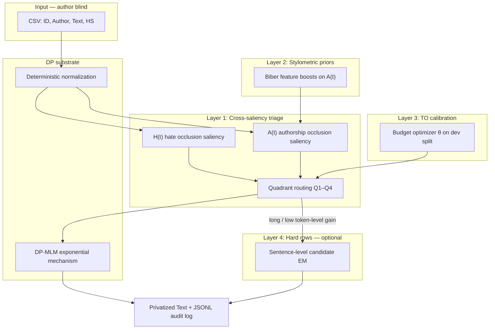

# TRIAGE-DP

**Task-aware, Re-identification-Informed, Adaptive Guard for Evidence-preserving Differential Privacy**

A research proposal for the **PrivHSD** challenge (Council of Europe Democracy Hackathon 2026).

---

## Executive summary

TRIAGE-DP is a text sanitization method for **identity-agnostic hate speech detection (IA-HSD)**. It privatizes **stylometric identity carriers** under formal differential privacy while **occlusion-protecting hate-evidence tokens**, with privacy budgets calibrated directly on the hackathon **Trade-Off (TO)** metric.

**One-sentence claim:** We formulate IA-HSD as a dual-saliency sanitization problem and route each token through a 2×2 triage grid (authorship saliency × hate saliency) before applying quadrant-specific DP-MLM actions—with automated TO calibration hiding parameter complexity from operators.

DP-MLM (Meisenbacher et al., TUM) is the **formal DP substrate**, not the research contribution. The contribution is the **PrivHSD-specific problem formulation**, **cross-saliency routing**, **stylometric priors**, and **TO-calibrated budget allocation**.

---

## 1. Problem formulation

### 1.1 The PrivHSD objective

From the hackathon trade-off definition:

```
TO = (Utility_protected / Utility_original) − (Privacy_protected / Privacy_original)
```

| Term | Meaning in PrivHSD | Direction |
|------|----------------------|-----------|
| **Utility** | Hate speech detection performance (e.g. macro-F1) | Higher is better |
| **Privacy** | Authorship re-identification attacker success (e.g. top-1 accuracy) | Lower is better |
| **TO** | Combined score | Maximize (range −1 to 1) |

The goal is moderation that works **without building re-identification tools**: HSD must remain effective while author identity is stripped from the text.

### 1.2 Identity-agnostic hate speech detection (IA-HSD)

We define **IA-HSD** as a new sanitization task:

| Specification | PrivHSD (IA-HSD) |
|---------------|------------------|
| **Privacy objective (p)** | Minimize authorship re-identification via stylometry |
| **Utility objective (u)** | Maximize hate speech detection performance |
| **Input** | Raw user-generated text |
| **Output** | Sanitized text safe to share for moderation / research |
| **Constraint** | Mechanism is **author-blind** (never sees `Author` or `HS` labels) |

This is **not** PII redaction (Presidio), **not** federated model training (NAACL 2025 FL-HSD), and **not** generic sentiment/NER utility (DP-MLM benchmarks).

### 1.3 Why uniform DP-MLM is insufficient

Organizer case study (approximate local TO):

| Method | TO | Learning |
|--------|-----|----------|
| Microsoft Presidio | −0.11 | PII anonymization wrong threat model |
| dpmlm (ε=50 / 25) | +0.50 / +0.31 | DP theory works; best baseline |
| GPT-4o mini (naive) | −0.36 | Generic LLM rewrite destroys task signal |

Organizers note: dpmlm is grounded in privacy theory and parameterized, but **introduces complexity**. They also **already have dpmlm**—incremental tweaks will not satisfy evaluation on problem understanding and impact.

Arnold et al. (*Differentially-Private Text Rewriting reshapes Linguistic Style*) further shows dpmlm is **register-blind**: it homogenizes text toward non-involved, non-persuasive register (loss of 2nd-person pronouns, place/time adverbials, discourse markers). Hate speech often uses **involved, direct, persuasive** register—uniform DP destroys the wrong linguistic material for HSD.

---

## 2. Research gap

| Prior work | Privacy threat | Utility task | Gap for PrivHSD |
|------------|----------------|--------------|-----------------|
| **DP-MLM** (TUM) | Author/gender re-ID | Sentiment, generic classification | Wrong utility; uniform token budget |
| **STAMP** (2026) | PII / named entities | SQuAD, Yelp, AG News | Privacy axis is NER, not stylometry |
| **Adaptive Text Anonymization** | LLM-inferred attributes | Domain-specific | LLM prompts, not formal per-token DP |
| **PrivRewrite** | Semantic leakage | Generic fluency | Black-box API; no HSD utility |
| **DP-MGTD** | Entity leakage | Machine vs human authorship | Different detection task |
| **Presidio** | Named entities | N/A | Wrong threat model |
| **Federated HSD** (2025) | Training-time gradients | HSD training | Sanitization at inference, not training |

**No existing method targets the dual objective: stylometric privacy + hate speech utility.**

---

## 3. System architecture



### Design principles

1. **Author-blind mechanism** — `privatize(text)` receives only `Text`; never `Author` or `HS`.
2. **Mechanism ≠ harness** — evaluation probes are separate copies; no import from `harness/` into `mechanism/`.
3. **Formal DP where claimed** — exponential-mechanism token selection (DP-MLM); per-token ε reported in audit log.
4. **Honest privacy claim** — normalization and canonicalization are empirical obfuscation without formal ε; no document-level DP claim.
5. **Explainability** — every token logs H(t), A(t), quadrant, action, ε, and reason.

---

## 4. Layer 1 — Cross-saliency token triage (core novelty)

Layer 1 decides, **per token**, how to treat it before any DP rewrite.

### 4.1 Occlusion saliency

For each word token `t` in text with tokens `t₁…tₙ`:

1. Run probe on full text → baseline score `S_full`
2. Remove `t` (mask with blank) → occluded text
3. Run probe again → `S_without(t)`
4. Saliency = drop when token is removed:

```
Δ(t) = S_full − S_without(t)
```

High Δ means the token is **salient** for what that probe measures.

### 4.2 Utility score H(t)

| Property | Value |
|----------|-------|
| **Probe** | Local hate/abuse classifier (e.g. `cardiffnlp/twitter-roberta-base-hate-latest`) |
| **Score** | P(hateful \| text) or equivalent logit |
| **Definition** | `H(t) = P_hate(full) − P_hate(full \ {t})` |
| **High H(t)** | Token is hate-evidence; removing it makes post look benign |
| **Low H(t)** | Token is neutral for hate classification |

Partially implemented in `Johnny t0-1.03/src/mechanism/saliency.py` (binary protect if `H(t) ≥ threshold`). Layer 1 extends this to full quadrant routing.

### 4.3 Privacy score A(t)

| Property | Value |
|----------|-------|
| **Probe** | Local stylometry / authorship model (char n-gram TF-IDF + linear SVM, or frozen transformer + linear probe — same family as harness `reident.py`) |
| **Constraint** | Must not use this row's `Author` label at runtime |

**Recommended deployment (author-blind):**

```
A(t) = confidence(full) − confidence(full \ {t})
```

where `confidence` = max class probability or margin of an authorship-style classifier trained on public stylometry statistics or batch-level patterns—not "predict author bob for this row."

**Alternative:** embedding shift `‖e(full) − e(full \ {t})‖` under a frozen authorship encoder.

| A(t) | Meaning |
|------|---------|
| **High** | Token carries writer identity (distinctive vocabulary, dialect, habits) |
| **Low** | Generic token; could appear in anyone's text |

### 4.4 Quadrant routing

Compare `H(t)` and `A(t)` to thresholds `τ_H` and `τ_A` (calibrated in Layer 3):

```
         H(t) ≥ τ_H  (utility-critical)     H(t) < τ_H  (utility-neutral)
        ┌─────────────────────────────────┬─────────────────────────────────┐
A(t)    │  Q1: PRIVACY + UTILITY CONFLICT │  Q2: PRIVACY-ONLY               │
≥ τ_A   │  Canonicalize + moderate DP     │  Aggressive DP (low ε)          │
        ├─────────────────────────────────┼─────────────────────────────────┤
A(t)    │  Q3: UTILITY-ONLY               │  Q4: NEUTRAL                    │
< τ_A   │  Skip DP (protect hate signal)  │  Skip or normalize only         │
        └─────────────────────────────────┴─────────────────────────────────┘
```

#### Q1 — High A, High H (conflict zone)

Example: obfuscated slur `d00fus` in a writer's habitual spelling.

- **Privacy:** spelling pattern identifies author
- **Utility:** semantic insult category must survive

**Action:** Canonicalize (`d00fus` → `dummy`); do **not** resample to neutral synonym. Optional moderate DP on surrounding context only.

#### Q2 — High A, Low H (primary privacy work)

Example: distinctive opener "honestly mate" in an otherwise neutral rant.

- Barely affects hate score; strongly carries authorship

**Action:** Aggressive DP (low ε); MLM samples stylistically different but semantically similar replacement. **Most privacy budget spent here.**

#### Q3 — Low A, High H (utility protection)

Example: common slur `moron` or context-dependent hate phrase.

- Critical for HSD; not author-specific

**Action:** Skip DP after normalization.

#### Q4 — Low A, Low H (neutral)

Example: `the`, `was`, generic glue words.

**Action:** Skip DP or deterministic normalization only (same as SPINE `function_word: skip`).

### 4.5 Worked example

**Input (author: bob):**  
`"Honestly you're such a d00fus, only a moron would believe that scam"`

| Token | H(t) | A(t) | Quadrant | Action |
|-------|------|------|----------|--------|
| Honestly | 0.02 | 0.31 | Q2 | Aggressive DP → e.g. "Really" |
| you're | 0.01 | 0.08 | Q4 | Skip |
| d00fus | 0.41 | 0.22 | Q1 | Canonicalize → `dummy` |
| moron | 0.38 | 0.11 | Q3 | Skip |
| scam | 0.12 | 0.09 | Q3 | Skip |
| (function words) | ~0 | ~0 | Q4 | Skip |

**Output (conceptual):**  
`"Really you're such a dummy, only a moron would believe that scam"`

Hate signal preserved; distinctive opener rewritten; writer-specific spelling canonicalized.

### 4.6 vs SPINE and STAMP

| Aspect | SPINE (baseline) | STAMP (2026) | Layer 1 (TRIAGE-DP) |
|--------|------------------|--------------|---------------------|
| Hate protection | Lexicon + optional binary H threshold | Task embedding similarity | Full H(t) → 4 actions |
| Privacy targeting | Rewrite all content tokens | PII / NER sensitivity | A(t) authorship occlusion |
| Token treatment | Fixed classes | 2×2 on PII × task | 2×2 on authorship × hate |
| Mechanism | DP-MLM | Polar embedding LDP | DP-MLM exponential mechanism |
| Per-text adaptation | No | Yes | Yes |

### 4.7 Audit log entry (per token)

```json
{
  "original": "d00fus",
  "normalized": "d00fus",
  "H": 0.41,
  "A": 0.22,
  "quadrant": "Q1",
  "action": "canonicalized",
  "epsilon": null,
  "replacement": "dummy",
  "reason": "high utility + high privacy spelling; canonicalized not resampled"
}
```

### 4.8 Computational cost and mitigations

Occlusion requires O(n) forward passes per probe per text (n = word tokens).

| Mitigation | Effect |
|------------|--------|
| Lexicon pre-filter | Skip occlusion on obvious Q3/Q4 |
| Content-word only | Do not occlude function words |
| Fast A(t) first | Char n-gram SVM for all; transformer H(t) on candidates |
| Batched inference | Batch occluded variants on GPU |

---

## 5. Layer 2 — Stylometric priors

Arnold et al. identify lexico-grammatical features that DP rewriting destroys: 2nd-person pronouns, place/time adverbials, discourse particles, certain subordination patterns. These are **identity carriers**, not hate carriers.

**Method:** Lightweight Biber-style (1991) feature tagger (rule-based, 67 features) boosts `A(t)` for tokens tagged as stylometric identity markers.

**Research claim:** dpmlm fails HSD partly because it is register-blind; TRIAGE-DP is register-targeted for IA-HSD—deliberately privatizing identity features while protecting hate-evidence tokens.

Layer 2 **refines** Layer 1 routing; it does not replace occlusion measurement.

---

## 6. Layer 3 — TO-calibrated budget optimizer

Addresses organizer criticism that dpmlm is "parameterized but complex."

### 6.1 Parameter vector θ

```
θ = { τ_H, τ_A, ε_Q1, ε_Q2, ε_Q4, ... }
```

- `τ_H`, `τ_A` — quadrant thresholds
- `ε_Q1`, `ε_Q2` — per-quadrant DP budgets (Q3/Q4 typically skip)

### 6.2 Optimization procedure

On a held-out dev split (same CSV schema; do not overfit to local harness probes as official score):

1. Sample or search over θ
2. Run TRIAGE-DP privatization
3. Score with local harness TO estimate
4. Select θ on Pareto front (utility vs privacy) or direct TO maximization
5. Ship **one user-facing dial** ("privacy level 1–5") mapped to pre-calibrated θ profiles

### 6.3 Output artifacts

- TO vs θ calibration curve
- Pareto frontier plot
- Recommended default θ for submission

---

## 7. Layer 4 — Sentence-level EM for hard rows

For long posts where token-level DP yields insufficient privacy gain (config gate: e.g. ≥40 tokens, or token-level re-ID reduction below threshold).

Scaffold exists in `Johnny t0-1.03/src/stretch/candidate_selection.py`.

**Pipeline:**

1. Local small open-weight model proposes **k** constrained rewrites (must preserve Q3/Q1 hate tokens flagged by Layer 1)
2. Score each candidate with hate classifier utility
3. Select one via **exponential mechanism** over utility scores (same DP math as `mechanism/dp.py`)

Inspired by PrivRewrite structure (candidate pool + EM) but **local**, **HSD-scored**, and **hate-constrained**—no black-box API.

---

## 8. Layer 5 — Rights-based architecture

Framing for evaluation criterion **Human Rights-Centered Innovation**, aligned with CoE work on combating hate speech.

| Principle | Technical embodiment |
|-----------|------------------------|
| Moderation without surveillance | Output usable for HSD; writer fingerprint stripped |
| Identity-agnostic processing | Mechanism never sees author identity |
| Accountability | Per-token JSONL audit log |
| No re-ID training corpora | Privatized release should not reliably train authorship models |
| Transparency | Dual-saliency scores explain why each token was treated |

**Narrative:** Platforms need to know **whether** content is hateful, not **who** wrote it in a re-identifiable form. TRIAGE-DP enables shared moderation datasets without building stylometric surveillance tools.

---

## 9. Implementation map (existing codebase)

| Component | Path | Role |
|-----------|------|------|
| DP exponential mechanism | `src/mechanism/dp.py` | Q2/Q1 rewrites |
| MLM backend | `src/mechanism/mlm.py` | Candidate scoring |
| Normalization | `src/mechanism/normalize.py` | Pre-triage |
| Lexicon | `src/mechanism/lexicon.py` | Fast pre-filter |
| Hate occlusion (partial) | `src/mechanism/saliency.py` | H(t) — extend to quadrants |
| Token classes (baseline) | `src/mechanism/salient.py` | Replaced by Layer 1 routing |
| Orchestrator | `src/mechanism/spine.py` | Wire triage + DP loop |
| CSV wrapper | `src/wrapper/run.py` | `--mode triage-dp` |
| Evaluation harness | `src/harness/evaluate.py` | TO, utility, re-ID |
| Sentence EM scaffold | `src/stretch/candidate_selection.py` | Layer 4 |

### To build

| Module | Description |
|--------|-------------|
| `mechanism/authorship_saliency.py` | A(t) occlusion probe |
| `mechanism/triage.py` | Quadrant routing Q1–Q4 |
| `mechanism/biber.py` | Stylometric feature tags (Layer 2) |
| `harness/calibrate.py` | TO budget optimizer (Layer 3) |
| `stretch/generative_proposer.py` | Local rewrite proposer (Layer 4) |

### Deprioritize

| Component | Reason |
|-----------|--------|
| `jules-testing/` | Off-task (Finnish classifiers) |
| Presidio | Negative baseline only |
| Naive GPT prompting | Negative baseline only |
| SPINE as headline | Ablation baseline, not main claim |

---

## 10. Evaluation plan

### 10.1 Baselines

1. **Identity** — no privatization (utility upper bound, privacy lower bound)
2. **dpmlm uniform** — organizer baseline (`--mode dpmlm`)
3. **Presidio / PII masking** — wrong threat model
4. **SPINE** — lexicon + fixed token classes (`--mode spine`)
5. **TRIAGE-DP full** — proposed method

### 10.2 Ablations

| Ablation | Tests |
|----------|-------|
| No cross-saliency | Fixed SPINE-like classes only |
| No stylometric priors | Layer 2 off |
| No TO calibration | Manual ε |
| No sentence-level EM | Layer 4 off |
| H(t) only | No A(t) routing |
| A(t) only | No H(t) protection |

### 10.3 Metrics

| Metric | Source |
|--------|--------|
| **TO** | Primary objective (local estimate + organizer hidden evaluator) |
| Utility macro-F1 | Harness `utility.py` |
| Re-ID top-1 accuracy | Harness `reident.py` |
| Burrows' Delta | Stylometric fidelity (Arnold methodology) |
| Qualitative examples | Hate preserved / identity stripped |

**Evaluation honesty:** Local TO uses our own probe models. Do not overfit θ to local probes; treat as smoke signal and relative comparison between configs.

### 10.4 Hypothesis

TRIAGE-DP beats uniform dpmlm because it **stops destroying hate-evidence in involved register** while **concentrating privacy budget on authorship-leaking tokens**—improving both terms of the TO ratio.

---

## 11. Positioning vs organizer dpmlm note

| Organizers on dpmlm | TRIAGE-DP response |
|---------------------|-------------------|
| Grounded in privacy theory ✓ | Keeps exponential mechanism / per-token ε-DP |
| Parameterized ✓ | More parameters, auto-calibrated on TO |
| Introduces complexity ✗ | Hidden behind one dial + explainable audit log |
| They already have it ✗ | New problem + dual-saliency + stylometric targeting |

---

## 12. Suggested team split

| Track | Focus | Deliverable |
|-------|-------|-------------|
| Research | Problem formulation, related work | Research note, citation table |
| Mechanism | H(t), A(t), triage, Biber priors | `triage.py`, `authorship_saliency.py` |
| Optimization | TO calibration | `calibrate.py`, Pareto plots |
| Evaluation | Harness, ablations, baselines | Results tables |
| Hard rows | Layer 4 generative proposer | `stretch/` completion |
| Rights & demo | CoE framing, judge demo | Presentation, example walkthrough |

---

## 13. Deliverables

1. **Working prototype** — CSV in → privatized CSV out (`--mode triage-dp`)
2. **Research note** — IA-HSD formulation, method, results, limitations, CoE alignment
3. **Reproducible configs** — calibrated θ profiles + ablation configs
4. **Audit logs** — per-token JSONL for transparency demo
5. **Baseline comparison table** — TO, utility, privacy decomposed

### Quickstart (target)

```bash
pip install -r requirements.txt -r requirements-hf.txt
pip install -e .
python scripts/setup_models.py
python scripts/setup_lexicons.py

# Privatize
python -m wrapper.run --in dev.csv --out dev_private.csv \
    --mode triage-dp --config configs/triage-dp.yaml

# Evaluate
python -m harness.evaluate --original dev.csv --privatized dev_private.csv \
    --config configs/triage-dp.yaml --utility-backend hf

# Calibrate (dev only)
python -m harness.calibrate --dev dev.csv --config configs/triage-dp.yaml \
    --output configs/triage-dp-calibrated.yaml
```

---

## 14. Limitations and follow-ups

- Per-token ε composition; no formal document-level DP claim
- English Reddit-style posts; generalization untested
- Occlusion cost scales with text length
- Local probes approximate organizer hidden evaluator
- Lexicon coverage gaps; H(t) depends on classifier choice
- Layer 4 generative proposer adds model weight and latency

**Follow-ups:** Multilingual IA-HSD; adaptive attacker during calibration; federated sanitization policy; formal composition bounds across quadrants.

---

## 15. References

| Reference | Relevance |
|-----------|-----------|
| Meisenbacher et al., **DP-MLM** ([arXiv:2407.00637](https://arxiv.org/abs/2407.00637)) | DP substrate |
| Arnold, **DP Rewriting reshapes Linguistic Style** | Register-blind critique; Biber features |
| Loiseau et al., **Adaptive Text Anonymization** | Task-conditioned anonymization framing |
| Tian et al., **STAMP** ([arXiv:2603.12237](https://arxiv.org/pdf/2603.12237)) | 2×2 token partitioning (different axes) |
| Wang et al., **DP-MGTD** | Adaptive budget allocation pattern |
| Kim, **PrivRewrite** | Candidate + EM structure (Layer 4) |
| Council of Europe, **Recommendation on combating hate speech** (2018) | Rights framing |
| PrivHSD hackathon materials (`resources/`) | TO metric, evaluation criteria, case study |

---

## Appendix A — Privacy claim (narrow)

Same as SPINE / DP-MLM:

- **Exponential-mechanism token selection** satisfies **ε-DP per rewritten token** with respect to clipped MLM logits.
- **Composition** is sequential; per-token ε and counts reported in JSONL log.
- **Normalization and canonicalization** are empirical obfuscation without formal ε.
- **No end-to-end document-level DP claim.**

---

## Appendix B — Relation to SPINE

SPINE (`Johnny t0-1.03`) is the **implementation substrate and ablation baseline**:

- SPINE ≈ fixed Q3 (lexicon) + Q4 (function words) + uniform Q2 (all other content)
- TRIAGE-DP replaces fixed rules with measured H(t) × A(t) routing and TO-calibrated θ

Do not position SPINE as the research contribution; position it as **"structured baseline before triage."**
