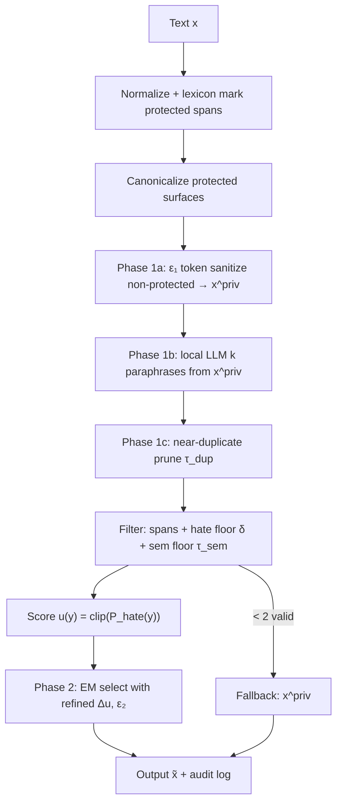
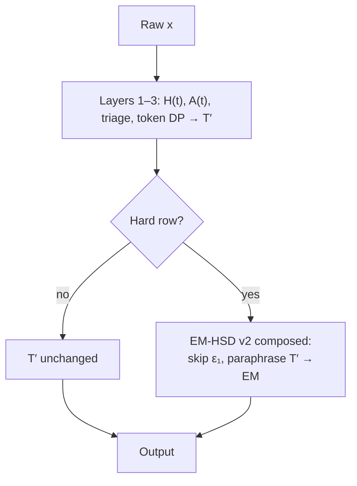
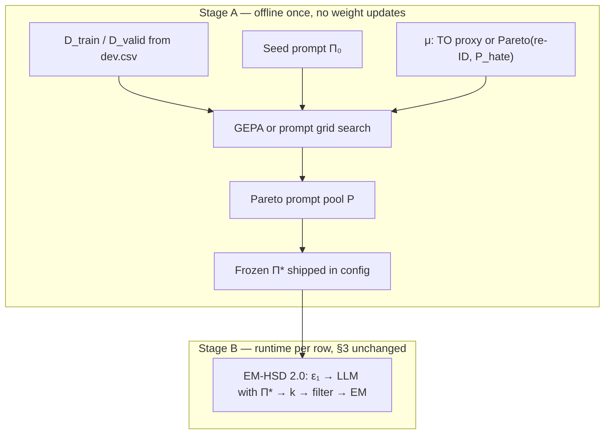

# EM-HSD 2.0: Layer 4 Proposal (v2)

**Constrained-Candidate Differential Privacy for Identity-Agnostic Hate Speech Detection**

PrivRewrite-informed upgrade of [layer-04-only-proposal.md](layer-04-only-proposal.md) (v1). **Dual-mode:** runs **standalone** (Layer-4-only submission track) or **composed** inside full [TRIAGE-DP](TRIAGE-DP.md) (Layers 1–3 token pass → EM-HSD v2 on hard rows). See also [`layer-05-rights-architecture.md`](layer-05-rights-architecture.md) and [`layer-04-sentence-level-em.md`](layer-04-sentence-level-em.md).

---

## Executive summary

**EM-HSD 2.0** privatizes text for identity-agnostic hate speech detection using a **two-phase** pipeline inspired by [PrivRewrite](../resources/PrivRewrite:%20Differentially%20Private%20Text%20Rewriting%20Under%20Black-Box%20Access%20with%20Refined%20Sensitivity%20Guarantees.md), adapted for PrivHSD:

| Phase | Action | Privacy budget |
|-------|--------|----------------|
| **Phase 1** | Protect hate spans → **selective token sanitize** on non-protected tokens (ε₁) → local **k** paraphrases → **near-duplicate prune** | ε₁ |
| **Phase 2** | Filter (spans + hate floor) → score **hate-primary utility** → **exponential mechanism** select one | ε₂ |

**Total:** **(ε₁ + ε₂)-DP** end-to-end under token-level adjacency (PrivRewrite Theorem 1 pattern).

**What changed from v1:**

| v1 | v2 |
|----|-----|
| Selection-only DP | **Composed ε₁ + ε₂** |
| Raw / normalized text → paraphrase | **x^priv** → paraphrase |
| No duplicate pruning | **τ_dup pruning** |
| Naive score clip | **Refined Δu** + EM-HSD-Naive ablation |
| Semantic utility absent | **τ_sem_min guard** (constraint, not primary objective) |
| Fallback to normalized text | **Fallback to x^priv** (ε₁-DP) |

**Claim:** PrivRewrite’s **structure** (two-phase, candidates, tight sensitivity) with **IA-HSD utility** (hate classifier, not semantic similarity) and **local** deployment (no black-box API).

**Deployment:** Same codebase, two runtime profiles — see **§3.3**.

---

## 0. Changelog from v1

| Component | v1 | v2 |
|-----------|----|----|
| Pre-paraphrase DP | None | Selective ε₁ on non-protected tokens |
| Candidate input | Original / normalized | **x^priv** |
| Pruning | None | Near-duplicate (PrivRewrite §4.1.3) |
| Utility u(y) | P_hate only | P_hate primary + semantic **floor** |
| Sensitivity | clip=5.0 default | **Refined Δu** bound |
| Privacy claim | ε on selection | **ε₁ + ε₂** |
| Fallback | Normalized text | **x^priv** |
| Ablations | Basic | + EM-HSD-Naive, + semantic-only EM |
| k default | 4 | 4–8 (still ≪ PrivRewrite’s 50) |

v1 remains a valid **minimal baseline**; v2 is the **recommended submission spec**.

---

## 1. Motivation

### 1.1 Why Layer 4 (standalone and composed)

EM-HSD 2.0 is the **Layer 4 engine** for TRIAGE-DP, not only a fork:

| Mode | When | Role |
|------|------|------|
| **Standalone** | Ship fast; no Layers 1–3 | Full pipeline on raw `x` for **every row** |
| **Composed** | Full TRIAGE-DP stack | Sentence-level pass on **hard rows** after Layers 1–3 produce **T′** |

Standalone keeps one path, O(k) cost, ~8 hyperparameters, strongest **execution** story. Composed adds phrase-level privacy where token-level triage leaves residual stylometry ([`layer-04-sentence-level-em.md`](layer-04-sentence-level-em.md) §9).

### 1.2 Why upgrade with PrivRewrite learnings

PrivRewrite strengthens hackathon **evaluation criteria** where v1 was weak:

| Criterion | v1 gap | v2 fix (from PrivRewrite) |
|-----------|--------|---------------------------|
| Problem understanding | Thin end-to-end DP | **(ε₁ + ε₂)** + Lemma-style Δu |
| Human rights | Local-only good; raw text to model | **ε₁** before paraphrase (local “sanitized view”) |
| Execution | Fragile when all candidates invalid | **Fallback to x^priv** |
| Impact | “Selection-only DP” | Composed DP + ablations vs naive |

### 1.3 What we do **not** copy from PrivRewrite

| PrivRewrite | EM-HSD 2.0 |
|-------------|------------|
| Black-box LLM API (Gemini) | **Local** open-weight paraphraser |
| Semantic similarity as **primary** utility | **P_hate primary**; similarity as **floor** |
| k = 10–50 | **k = 4–8** |
| Token sanitize on **all** tokens | Skip ε₁ on **protected hate spans** |
| MedQuAD / IMDB eval | **TO + F1 + re-ID** |

Case study: naive GPT (TO ≈ −0.36) ≈ unconstrained semantic paraphrase. v2 avoids that failure mode via **constraints + hate utility**, not via PrivRewrite’s similarity objective.

---

## 2. Problem formulation

Maximize PrivHSD trade-off:

```
TO = (Utility_protected / Utility_original) − (Privacy_protected / Privacy_original)
```

| Term | Meaning |
|------|---------|
| Utility | Hate speech detection macro-F1 |
| Privacy | Authorship re-ID top-1 accuracy (lower after sanitization) |
| Mechanism input | **Text only** — never `Author` or `HS` |

**IA-HSD:** sanitize for **stylometric privacy**, preserve **hate detection signal**.

**Neighboring relation (DP):** token-level — two sequences differ in at most one token (PrivRewrite §3.2). Protected-span skip policy is documented as **utility policy** with honest limitation (§9).

---

## 3. Architecture

### 3.1 Pipeline (standalone — all rows)

When `deployment_mode: standalone`, every row runs the full pipeline below. In **composed** mode, Phase 1a (ε₁) is skipped; input is **T′** and Phases 1b–2 run unchanged (§3.3).



### 3.2 Step table

| Step | Phase | Formal DP? |
|------|-------|------------|
| Normalize, lexicon, canonicalize | Pre | No (empirical) |
| ε₁ token sanitize (non-protected only) | 1a | **Yes (ε₁)** |
| k paraphrases from x^priv | 1b | Post-processing of ε₁ output |
| Near-duplicate prune | 1c | Post-processing |
| Span / hate / semantic filters | 2 pre | No |
| Hate utility scoring | 2 pre | No |
| Exponential mechanism selection | 2 | **Yes (ε₂)** |
| Fallback to x^priv | Post | Preserves ε₁ |

### 3.3 Deployment modes (standalone vs composed)

EM-HSD 2.0 is **one module**, two entry contracts. Config key: `em_hsd_v2.deployment_mode: standalone | composed`.

#### Mode A — Standalone (Layer-4-only track)

**Input:** raw text `x` from CSV. **All rows** take the full §3.1 pipeline.


| Property | Value |
|----------|--------|
| Rows | 100% |
| Phase 1a ε₁ | **On** (non-protected tokens) |
| Lexicon / normalize | **Inside** EM-HSD (same as SPINE pre-pass) |
| Layers 1–3 | **Not required** |
| CLI | `--mode em-hsd-v2` / `em-hsd-run` |
| Primary use | Hackathon execution track, ablations, dpmlm comparison |

#### Mode B — Composed (inside TRIAGE-DP L1–L4)

**Input:** token-sanitized text **T′** after Layers 1–3; optional upstream context from Layer 1 audit.



| Property | Standalone | Composed |
|----------|------------|----------|
| Input to L4 | Raw `x` | **T′** (post token pass) |
| Phase 1a ε₁ | Run on `x` | **Skip** (ε already spent in L1–3) |
| Paraphrase input | `x^priv` | **T′** (treat as sanitized view) |
| Protected spans | Lexicon on `x` | **Layer 1 log** (preferred) or lexicon on original |
| Hate floor δ | `P_hate(y) ≥ P_hate(x) − δ` | Same vs **original `x`** (not T′) |
| Semantic floor | vs original `x` | vs original `x` |
| Privacy budget | ε_total = ε₁ + ε₂ | **ε_sentence** (= ε₂ only at L4); token ε in L1–3 log |
| Row coverage | All rows | **Gated** (~10–30% hard rows; see [`layer-04-sentence-level-em.md`](layer-04-sentence-level-em.md) §2) |

**Integration API (target):**

```python
# Standalone
privatize_em_hsd_v2(text=x, config=config)

# Composed (called from triage-dp orchestrator after token pass)
privatize_em_hsd_v2(
    text=T_prime,
    config=config,  # deployment_mode: composed
    original_text=x,
    protected_spans=l1_audit["protected_spans"],  # optional
    upstream_token_log=l1_audit["token_log"],     # optional merge
)
```

**Orchestrator hook (full stack):**

```python
T_prime, token_log = triage_dp_token_pass(x, config)
if config.stretch.enabled and is_hard(T_prime, x, config):
    T_out, l4_audit = privatize_em_hsd_v2(
        T_prime, config,
        original_text=x,
        protected_spans=extract_protected(token_log),
    )
else:
    T_out = T_prime
```

See [`triage-dp-layers-1-4-operational-model.mmd`](triage-dp-layers-1-4-operational-model.mmd).

#### Shared core (both modes)

Unchanged between modes:

- Phase 1b–1c: k paraphrases + τ_dup prune  
- Phase 2: span + hate floor + sem floor + EM (ε₂)  
- Fallback to input sanitized view (`x^priv` standalone, **T′** composed)  
- Audit schema (mode field records `standalone` | `composed`)

#### What composed mode does **not** duplicate

| Layer 1–3 responsibility | EM-HSD v2 in composed mode |
|--------------------------|----------------------------|
| H(t), A(t), Q1–Q4 routing | **Skip** — already applied in T′ |
| Token-level DP (Q2) | **Skip** — ε₁ not re-run |
| Biber boosts (L2) | **Skip** |
| θ calibration (L3) | L3 sets `epsilon_sentence`; L4 uses ε₂ slice |

#### Lexicon in both modes

| Source | Standalone | Composed |
|--------|------------|----------|
| Protected spans | `mechanism/lexicon.py` on raw `x` | **Prefer** Layer 1 audit list; fallback lexicon on `x` |
| Canonicalize before ε₁ | Yes | N/A (T′ already canonicalized Q1 tokens) |
| Span filter on candidates | Canonical skeleton ⊆ `y` | Same |
| Proposer `{protected_list}` | From lexicon hits | From L1 log or lexicon |

Aligns with [TRIAGE-DP.md](TRIAGE-DP.md) Appendix B: standalone ≈ SPINE lexicon path + L4; composed = measured triage + L4 on hard rows only.

---

## 4. Phase 1 — Sanitized candidate generation

### 4.1 Protected spans (unchanged from v1)

- Obfuscation-aware **hate lexicon** (`mechanism/lexicon.py`)
- **Canonicalize** protected surfaces (`d00fus` → `dummy`) before ε₁
- Protected tokens: **excluded from ε₁** sampling (utility policy)

### 4.2 Selective token sanitization (ε₁) — **new in v2**

Adapt PrivRewrite §4.1.1 **only for non-protected positions**.

For each non-protected token position `i`:

```
Pr[x_i^priv = t | x_i] ∝ exp( (ε₁/2) · u(t; x_i) )
```

where `u(t; x_i)` = clipped cosine similarity in **public** unit-norm embedding space (bounded → sensitivity 1 per position).

| Token | ε₁ applied? |
|-------|-------------|
| Protected hate span | **No** — frozen / canonical only |
| URL, @mention | Optional redact or sanitize (high identity) |
| All other tokens | **Yes** |

**Composition:** independent positions → **ε₁-DP** for full x → x^priv under token adjacency (parallel composition).

**Implementation target:** `stretch/token_sanitize.py` (reuse `mechanism/dp.py` exponential weights over embedding neighbors; top-M candidate vocab per token, not full V).

**Privacy narrative:** paraphraser never sees raw stylometric text — only **x^priv** (PrivRewrite provider argument, but **local**).

### 4.3 Local candidate generation (ε₁ post-processing)

**Module:** `stretch/generative_proposer.py`

| Setting | Value |
|---------|--------|
| Model | `google/flan-t5-base` (pinned) or Pegasus-paraphrase |
| Input | **x^priv** (not raw x) |
| k | 4–8 default |
| Decode | Batched diverse: `num_return_sequences=k`, `num_beams≥k`, `diversity_penalty>0` |

**Prompt:**

```
Rewrite the post below with different wording and style.
Rules:
- KEEP these terms unchanged in meaning: {protected_list}
- Do not remove insults or soften offensive content
- Change distinctive phrasing, openers, and stylistic tics
- Similar length (±25%)
Output only the rewritten post.

Post: {x_priv}
```

Generation is **post-processing** of x^priv — does not consume additional DP budget (PrivRewrite §4.1.2).

### 4.4 Near-duplicate pruning — **new in v2**

From PrivRewrite §4.1.3:

- Fixed sentence encoder ψ (e.g. small sentence-transformer or mean-pooled distilroberta)
- Cosine similarity `s(y, y') ∈ [0, 1]`
- Greedy **τ_dup**-separated subset of k candidates

| τ_dup | Effect |
|-------|--------|
| High (0.85) | Fewer, more diverse candidates |
| Low (0.65) | More candidates, more redundancy |

Default: **τ_dup = 0.80** (PrivRewrite paper default).

---

## 5. Phase 2 — Differentially private selection

### 5.1 Candidate filters (hard constraints)

Reject candidate `y` if any fails:

| Filter | Rule | Role |
|--------|------|------|
| **Span preservation** | Protected canonical skeleton ⊆ y | Hate evidence (v1) |
| **Hate floor** | P_hate(y) ≥ P_hate(x) − δ | Utility guard (v1) |
| **Semantic floor** | SBERT-Cos(y, x) ≥ τ_sem_min | Block nonsense / empty rewrite (**v2**, PrivRewrite-inspired **constraint**) |
| **Length** | 0.4 ≤ len(y)/len(x) ≤ 2.5 | Stability |
| **Min edit** | Edit distance ratio ≥ min_edit_ratio | Force some change for privacy |

**Critical:** τ_sem_min is a **floor**, not the EM objective. PrivRewrite optimizes similarity; we **require minimum coherence** while maximizing hate utility.

Optional soft blend (calibration only, default off):

```
u_x(y) = α · P_hate(y) + (1−α) · s_sem(x,y)     α = 1.0 default
```

### 5.2 Utility function (primary)

```
u_x(y) := clip_{[0,1]}( P_hate(y) )
```

- Fixed local hate classifier (separate from harness)
- Same family as evaluation utility probe; **never import harness in mechanism**

### 5.3 Refined sensitivity — **new in v2**

PrivRewrite Lemma 1: Δu ≤ min(1, 2/(Tρ)) for **semantic** utility.

For EM-HSD 2.0, publish a **bounded sensitivity** for selection:

**Practical bound (implementation v2.0):**

```
Δu ≤ min(1, 2/L)
```

where L = token length of text, assuming:

- P_hate clipped to [0, 1]
- Classifier logits Lipschitz with respect to mean token embedding perturbation at one position

**EM-HSD-Naive baseline:** Δu = 1 (PrivRewrite-Naive analogue) — ablation isolates value of tight bound.

Exponential mechanism (same as `mechanism/dp.py`):

```
Pr[select y] ∝ exp( ε₂ · u_x(y) / (2 · Δu) )
```

### 5.4 End-to-end privacy

**Theorem (EM-HSD 2.0, composition).** Phase 1 satisfies ε₁-DP; Phase 2 satisfies ε₂-DP; sequential composition → **(ε₁ + ε₂)-DP** for final output x̃ (unless fallback returns x^priv only → ε₁-DP still valid).

Report **ε_total = ε₁ + ε₂** in audit log; default split **ε₁ = ε₂ = ε_total / 2** (standalone).

**Composed mode (TRIAGE-DP L1–L4):** token ε is spent in Layers 1–3; Layer 4 spends **ε_sentence = ε₂ only** (`epsilon_split: 1.0` in config). Audit records `deployment_mode: composed`, `epsilon_1_spent_here: 0`, and merges upstream token log when provided. End-to-end privacy is **token ε (L1–3) + ε_sentence (L4)** under sequential composition across orchestrator stages.

### 5.5 Fallback — **upgraded in v2**

| Situation | Action | DP status |
|-----------|--------|-----------|
| ≥ 2 valid candidates | EM select | ε₁ + ε₂ |
| 1 valid candidate | Return it | ε₁ (+ post-processing) |
| 0 valid candidates | Return **x^priv** | **ε₁** (PrivRewrite §4.3.2) |
| Proposer failure | Return **x^priv** | ε₁ |
| Never | Return raw x | — |

---

## 6. Hyperparameters

```yaml
em_hsd_v2:
  deployment_mode: standalone   # standalone | composed (with TRIAGE-DP L1–3)
  epsilon_total: 18.0           # standalone: ε₁+ε₂; composed: ε_sentence (ε₂ only)
  epsilon_split: 0.5            # standalone: ε₁=ε₂=half; composed: use 1.0       # user dial; split below
  epsilon_split: 0.5        # ε₁ = ε₂ = epsilon_total * split

  # Phase 1
  k_generate: 6             # before prune
  k_max_after_prune: 4      # target m for EM
  tau_dup: 0.80
  token_sanitize_top_m: 32  # embedding neighbors per token
  generation_temperature: 0.9

  # Phase 2
  hate_floor_delta: 0.05    # δ
  tau_sem_min: 0.55         # semantic floor (tune on dev)
  min_edit_ratio: 0.08
  clip: 5.0                 # fallback if refined Δu disabled
  use_refined_delta_u: true
  utility_alpha: 1.0        # 1.0 = hate-only EM objective

lexicon:
  enabled: true
  path: data/lexicons/hate_terms.txt

generation:
  model: google/flan-t5-base
  max_new_tokens: 256

embedding:
  model: sentence-transformers/all-MiniLM-L6-v2  # prune + token sanitize
```

**Composed profile** (`configs/em-hsd-v2-composed.yaml`):

```yaml
em_hsd_v2:
  deployment_mode: composed
  epsilon_total: 9.0      # sentence budget only (ε₂)
  epsilon_split: 1.0      # skip ε₁ at Layer 4
```

Call with `original_text=x`, `text=T_prime`, optional `protected_spans` from Layer 1 audit.

### 6.1 User-facing privacy dial (levels 1–5)

Maps to **ε_total** only; internal ε₁=ε₂=ε_total/2 fixed.

| Level | ε_total | δ | τ_sem_min | Intent |
|-------|---------|---|-----------|--------|
| 1 Utility-first | 36 | 0.02 | 0.50 | Max F1 |
| 2 | 28 | 0.05 | 0.52 | |
| 3 **Default** | 20 | 0.05 | 0.55 | Balance |
| 4 | 12 | 0.08 | 0.58 | |
| 5 Privacy-first | 6 | 0.10 | 0.60 | Max re-ID reduction |

Calibrate on dev holdout; grid primarily **{ε_total, k, δ}**.

### 6.2 vs v1 and full TRIAGE-DP

| | v1 | **v2** | Full TRIAGE-DP |
|--|----|--------|----------------|
| DP phases | 1 (selection) | **2 (ε₁+ε₂)** | Token + optional sentence |
| Hyperparams | ~4 | **~8** | 15+ |
| Occlusion | No | No | Yes |
| PrivRewrite alignment | Structural | **Formal + ablations** | Partial (Layer 4 only) |

---

## 7. Privacy claim (narrow and exact)

**We claim:**

1. **Phase 1:** ε₁-DP token sanitization on non-protected positions (exponential mechanism over bounded embedding utilities).
2. **Phase 2:** ε₂-DP selection among candidates via exponential mechanism with sensitivity Δu (refined or naive in ablation).
3. **Composition:** (ε₁ + ε₂)-DP for final output when EM runs; ε₁-DP on fallback.

**We do not claim:**

- DP on generative decoding (post-processing of x^priv)
- DP on protected-span freeze policy (utility exception — document openly)
- Document-level DP beyond stated token adjacency
- Normalization / canonicalization formal ε

---

## 8. Audit log (v2)

```json
{
  "mode": "em-hsd-v2",
  "deployment_mode": "standalone",
  "epsilon_total": 18.0,
  "epsilon_1": 9.0,
  "epsilon_2": 9.0,
  "epsilon_1_spent_here": 9.0,
  "delta_u": 0.038,
  "delta_u_naive": 1.0,
  "k_generated": 6,
  "k_after_prune": 4,
  "k_valid": 3,
  "protected_spans": ["dummy", "moron"],
  "P_hate_original": 0.91,
  "P_hate_x_priv": 0.88,
  "candidates": [
    {
      "text_hash": "a1b2...",
      "P_hate": 0.89,
      "s_sem": 0.74,
      "valid": true
    },
    {
      "text_hash": "c3d4...",
      "P_hate": 0.41,
      "s_sem": 0.81,
      "valid": false,
      "reject": "hate_floor"
    },
    {
      "text_hash": "e5f6...",
      "P_hate": 0.87,
      "s_sem": 0.71,
      "valid": true
    }
  ],
  "selected_index": 0,
  "selection_probs": [0.68, 0.12, 0.20],
  "fallback": false,
  "fallback_kind": null
}
```

Demo script: show **x → x^priv → 3 candidates → selected** with reject reasons.

---

## 9. Evaluation against PrivHSD criteria

### 9.1 Problem understanding

| Question | EM-HSD 2.0 answer |
|----------|-------------------|
| Privacy–HSD tension? | ε₁ breaks stylometry; constraints + P_hate EM preserve HSD |
| Literature? | PrivRewrite (two-phase), DP-MLM (EM), case study, CoE |
| vs dpmlm? | Sentence candidates + **task utility** vs uniform token MLM |
| vs PrivRewrite? | Same skeleton; **hate-primary** utility; **local**; IA-HSD metrics |

**Deliverable:** ablation **semantic-only EM** on same candidates (should hurt TO — proves problem understanding).

### 9.2 Human rights–centered innovation

| Question | EM-HSD 2.0 answer |
|----------|-------------------|
| Privacy + HSD? | ε₁ + constraints + hate EM |
| Understandable? | “Sanitize tokens → k rewrites → keep hate → DP picks one” |
| No surveillance API? | **Local models only** |
| Accountability? | Full candidate audit + fallback reason |

### 9.3 Execution and feasibility

| Question | EM-HSD 2.0 answer |
|----------|-------------------|
| Works? | Extends existing stretch scaffold |
| TO vs dpmlm? | **Must measure** on dev holdout |
| Robust? | Prune + fallback to x^priv |
| Reusable? | `--mode em-hsd-v2`, configs, tests |

### 9.4 Impact and alignment

| Question | EM-HSD 2.0 answer |
|----------|-------------------|
| Societal need? | Moderation corpora without stylometric fingerprints |
| Publication? | *Task-conditioned two-phase DP for IA-HSD* |
| Limitations? | Protected-span policy; dialect; English; local TO ≠ official score |

---

## 10. Experimental plan

### 10.1 Baselines

1. Identity  
2. dpmlm uniform (organizer)  
3. Presidio (negative)  
4. Naive local paraphrase (no ε, no constraints) — GPT-analogue  
5. **EM-HSD v1** (selection-only)  
6. **EM-HSD 2.0** (full)  
7. *(Optional)* SPINE / full TRIAGE-DP  

### 10.2 Ablations (v2-specific)

| ID | Config | Hypothesis |
|----|--------|------------|
| A1 | No ε₁ (paraphrase raw x) | Privacy weakens |
| A2 | No protected spans | Utility collapses |
| A3 | No hate floor δ | Utility collapses |
| A4 | No EM (argmax P_hate) | Privacy collapses |
| A5 | **EM-HSD-Naive** (Δu=1) | Lower TO than refined Δu |
| A6 | **Semantic-only EM** (PrivRewrite utility on same k) | Lower HSD F1 / TO |
| A7 | No τ_dup prune | Redundant candidates, weaker selection privacy |
| A8 | No τ_sem_min | Fluent nonsense possible |

### 10.3 Metrics

| Metric | Role |
|--------|------|
| **TO** | Primary |
| Utility macro-F1 | Harness |
| Re-ID top-1 | Harness |
| Valid candidate rate | Diagnostic |
| SBERT-Cos(x, x̃) | Secondary (not optimized) |
| Latency / row | Feasibility |
| Fallback rate | Robustness |

### 10.4 Success criteria

| Outcome | Action |
|---------|--------|
| TO > dpmlm holdout | Ship **v2** as primary |
| TO ≈ dpmlm | Ship v2 + strong write-up / demo |
| TO < dpmlm | Tune {ε_total, δ, τ_sem_min}; try v1 hybrid canonicalize only |

### 10.5 Key hypothesis

**Hate-primary two-phase EM** beats **semantic-primary** (PrivRewrite) and **token-uniform** (dpmlm) on TO when hate signal is span-local and stylometry is phrase-level.

---

## 11. Implementation plan

### 11.1 Modules

| Module | Path | Status |
|--------|------|--------|
| EM select | `stretch/candidate_selection.py` | Done |
| Token ε₁ sanitize | `stretch/token_sanitize.py` | **Build** |
| Generative proposer | `stretch/generative_proposer.py` | **Build** |
| Near-duplicate prune | `stretch/prune_candidates.py` | **Build** |
| Filters + scorer | `stretch/constraints.py`, `utility_scorer.py` | **Build** |
| Refined Δu | `stretch/sensitivity.py` | **Build** |
| Orchestrator | `em_hsd/em_hsd_v2.py` | Done |
| Composed entry | `privatize_em_hsd_v2(..., original_text=, protected_spans=)` | Done |
| Config standalone | `configs/em-hsd-v2.yaml` | Done |
| Config composed | `configs/em-hsd-v2-composed.yaml` | Done |
| CLI standalone | `em-hsd-run` / `em_hsd_cli/run.py` | Done |
| CLI full stack | `wrapper/run.py --mode triage-dp` | **Build** |
| Calibrate | `harness/calibrate_em.py` | **Build** |
| Tests | `tests/test_em_hsd_v2.py` | **Build** |

### 11.2 Engineering order

1. Filters + P_hate scorer + EM on mock candidates  
2. Token sanitize ε₁ → x^priv (synthetic)  
3. Generative proposer on x^priv  
4. Prune + full pipeline + fallback  
5. Refined Δu + EM-HSD-Naive flag  
6. Grid calibrate on dev  
7. Ablations A1–A8  
8. Research note + demo  

### 11.3 Quickstart (target)

```bash
pip install -r requirements.txt -r requirements-hf.txt
pip install -e .
python scripts/setup_models.py
python scripts/setup_lexicons.py

python -m wrapper.run --in dev.csv --out dev_private.csv \
    --mode em-hsd-v2 --config configs/em-hsd-v2.yaml

python -m harness.evaluate --original dev.csv --privatized dev_private.csv \
    --config configs/em-hsd-v2.yaml --utility-backend hf

python -m harness.calibrate_em --dev dev.csv \
    --config configs/em-hsd-v2.yaml --output configs/em-hsd-v2-calibrated.yaml
```

---

## 12. Positioning summary

| Method | Relationship to EM-HSD 2.0 |
|--------|--------------------------|
| **PrivRewrite** | Structural ancestor; we swap utility, add hate constraints, go local, selective ε₁ |
| **dpmlm** | Token-uniform competitor; we add sentence candidates + hate EM |
| **GPT naive** | Negative baseline |
| **EM-HSD v1** | Ablated subset (no ε₁, no prune, selection-only claim) |
| **Full TRIAGE-DP** | Composed mode on hard rows; standalone wins on ship speed |
| **Loiseau adaptive prompts** | Optional offline §15; complements v2, does not replace ε-DP |

**Public name:** **EM-HSD 2.0** or **IA-HSD-PrivRewrite** (internal).

---

## 13. Research note outline (v2)

1. Introduction — IA-HSD; case study GPT failure  
2. Related work — PrivRewrite, DP-MLM, dpmlm, CoE  
3. Threat model — stylometry + HSD  
4. Method — Phase 1 (selective ε₁, k, prune); Phase 2 (hate EM, refined Δu)  
5. **Optional:** Adaptive prompt layer (Loiseau et al.) — offline only  
6. **Why not PrivRewrite utility** — ablation A6  
7. Privacy analysis — composition, limitations on protected spans  
8. Rights architecture — abbreviated Layer 5  
9. Experiments — baselines + A1–A8 (+ A9 prompt ablation)  
10. Limitations & follow-ups  

Target: 5–7 pages.

---

## 14. Limitations

- Protected hate tokens **excluded** from ε₁ — utility policy, weakens formal uniform DP story  
- Generative paraphrase not DP; depends on x^priv quality  
- τ_sem_min, δ, lexicon are English-centric tuning choices  
- Refined Δu for neural classifiers is approximate — report naive ablation  
- k-generation cost scales with post length (mitigated by small k, batching)  
- Local TO ≠ organizer hidden evaluator  
- Dialect / register homogenization risk from paraphraser  

---

## 15. Adaptive Text Anonymization layer (optional, offline)

Extension inspired by Loiseau et al., [*Adaptive Text Anonymization: Learning Privacy-Utility Trade-offs via Prompt Optimization*](../resources/Adaptive%20Text%20Anonymization:%20Learning%20Privacy-Utility%20Trade-offs%20via%20Prompt%20Optimization.md). This layer is **optional**. EM-HSD 2.0 runs without it using a hand-written paraphrase prompt (§4.3). When enabled, it replaces manual prompt engineering with **offline prompt optimization** — not model training.

### 15.1 Does this require training?

| Question | Answer |
|----------|--------|
| Fine-tune paraphraser or hate classifier? | **No** |
| Update embedding weights? | **No** |
| Offline prompt search on dev? | **Yes** (optional, once before submission) |
| Use dev labels in mechanism at runtime? | **No** — Author / HS only in feedback μ during offline opt |

**Summary:** No neural **training**. Optional **offline learning** of paraphrase instructions Π via GEPA (or simpler grid over prompt templates), with frozen pretrained models throughout.

### 15.2 Why add it to v2

Loiseau et al. argue that anonymization is **task-conditioned**: each deployment needs an explicit privacy spec **p** and utility spec **u**, and a **single hand-written prompt** is brittle. That matches PrivHSD:

| Loiseau (p, u) | IA-HSD (EM-HSD 2.0) |
|----------------|---------------------|
| **p** — what to protect | Stylometric re-ID; authorial fingerprint (openers, tics, dialect) |
| **u** — what to preserve | Hate speech detectability (moderation utility) |

v2 already encodes (p, u) in **filters + P_hate EM**. The adaptive layer optimizes the **natural-language paraphrase prompt** so the local LLM better satisfies (p, u) **before** ε₂ selection — without replacing formal (ε₁ + ε₂)-DP.

**SynthPAI** (same paper) is the closest prior benchmark: Reddit-style text, privacy from stylometric/demographic inference, utility from content preservation. PrivHSD differs in **u** (HSD F1, not ROUGE) and in **formal DP** at token + selection steps.

### 15.3 Two-stage deployment model



- **Stage A (Loiseau):** optimize **prompt text** under budget **B** forward passes.  
- **Stage B (v2):** unchanged DP pipeline; only the paraphrase instruction changes from hand-written → **Π\***.

### 15.4 Task specification embedded in prompts

Seed prompt Π₀ should state (p, u) explicitly for GEPA to mutate:

```
Privacy (p): Remove author-identifying style (habitual openers, distinctive
  phrasing, dialect markers). Do not produce text that could identify the writer.

Utility (u): Preserve hate/offensive meaning for content moderation.
  KEEP unchanged in meaning: {protected_list}

Rewrite the post below. Output only the rewritten post.

Post: {x_priv}
```

GEPA evolves wording and emphasis; **protected_list** and filter constraints (§5.1) remain hard gates at runtime.

### 15.5 Feedback metric μ (offline only)

Loiseau uses scalar μ aggregating privacy + utility. For IA-HSD, define on **D_valid** without passing Author into `privatize()`:

**Option A — TO proxy (recommended for calibration alignment):**

```
μ(Π) = mean TO_estimate over D_valid
     = mean( U_ratio(Π) − P_ratio(Π) )
```

Run full EM-HSD 2.0 pipeline with prompt Π; score with local harness (same probes as §10).

**Option B — Pareto (Loiseau-style, for prompt pool):**

```
μ_priv(Π) = 1 − mean re-ID accuracy on sanitized texts
μ_util(Π) = mean P_hate preserved (or macro-F1 proxy)
```

Retain **non-dominated** prompts in pool **P**; pick Π* on validation or map levels 1–5 to Pareto front.

**Rich feedback (optional Stage 3):** decompose μ into reject reasons — `hate_floor`, `span`, `sem_floor`, `fallback_rate`, per-row utility/privacy drops — to guide GEPA mutation (Loiseau §3.5). Implement as structured log summary, not a second LLM, if budget is tight.

### 15.6 Privacy dial: ε + prompt level

Extend §6.1 user dial to two knobs (both fixed at runtime after offline opt):

| Level | ε_total | Prompt |
|-------|---------|--------|
| 1 Utility-first | High | Π_util (Pareto: max P_hate / F1) |
| 3 Default | Medium | Π* (max TO on holdout) |
| 5 Privacy-first | Low | Π_priv (Pareto: min re-ID) |

Same (ε₁, ε₂) split inside each level; prompt selects **how** the LLM rewrites, ε controls **DP noise**.

### 15.7 What we do not adopt from Loiseau

| Loiseau choice | EM-HSD 2.0 + adaptive layer |
|----------------|------------------------------|
| Prompt-only anonymization (no ε-DP) | Keep **ε₁ + ε₂** |
| GEPA at **runtime** per row | **Offline only** |
| Utility = ROUGE / semantic similarity | **P_hate primary**; τ_sem_min as floor only |
| Closed API evaluator (Gemini) | Local harness probes only |
| 27B+ models required | Same small local paraphraser as §4.3 |
| Replace EM with best prompt output | **Phase 2 EM always** for selection DP |

### 15.8 Implementation additions

| Module | Path | Role |
|--------|------|------|
| Seed + Pareto prompts | `prompts/em-hsd/seed.txt`, `prompts/em-hsd/pareto/` | Shipped artifacts |
| Prompt optimizer | `stretch/prompt_opt/gepa.py` or `stretch/prompt_opt/grid.py` | Offline Stage A |
| Feedback runner | `stretch/prompt_opt/feedback.py` | Runs v2 pipeline + μ on dev |
| Config | `configs/em-hsd-v2-adaptive.yaml` | `prompt_source: hand \| optimized`, `prompt_id` |

**Offline CLI (target):**

```bash
python -m stretch.prompt_opt.run \
    --dev dev.csv \
    --config configs/em-hsd-v2.yaml \
    --budget 800 \
    --output prompts/em-hsd/pareto/ \
    --metric to_proxy

# Runtime uses optimized prompt
python -m wrapper.run --in dev.csv --out dev_private.csv \
    --mode em-hsd-v2 --config configs/em-hsd-v2-adaptive.yaml
```

Paper uses **B ≈ 1500** forward passes on **|D_train| = |D_valid| ≈ 111**; scale to available dev size and CPU budget.

### 15.9 Ablation

Add to §10.2:

| ID | Config | Tests |
|----|--------|-------|
| **A9** | Hand prompt (§4.3) vs **optimized Π\*** (§15) | Value of adaptive layer; same ε, same EM |

Report TO, F1, re-ID, valid-candidate rate, fallback rate for both.

### 15.10 Limitations (adaptive layer)

- Prompt optimization **overfits dev** if B is large or D_valid is small — hold out a **test fold** never used in GEPA.  
- μ uses **local** probes; optimized Π* may not transfer to organizer hidden evaluator.  
- GEPA adds **engineering complexity**; grid over 5–10 hand-crafted template variants is a lighter fallback.  
- Optimizing Π does **not** replace ε calibration — both are needed.  
- Still **no formal DP** on prompt text itself; DP claims remain on ε₁ and ε₂ only.

### 15.11 Positioning in one sentence

> **EM-HSD 2.0** supplies formal task-conditioned **mechanisms** (PrivRewrite + IA-HSD utility); the **adaptive layer** supplies task-conditioned **instructions** (Loiseau), optimized offline without training.

---

## 16. References

| Reference | Role |
|-----------|------|
| Kim, **PrivRewrite** (2025) | Two-phase, prune, refined Δu, fallback |
| Loiseau et al., **Adaptive Text Anonymization** (2025) | Offline GEPA prompt opt, (p,u), Pareto dial — §15 |
| Meisenbacher et al., **DP-MLM** | Exponential mechanism implementation |
| Organizer **case study** | dpmlm vs GPT |
| [`layer-04-only-proposal.md`](layer-04-only-proposal.md) | v1 baseline spec |
| [`layer-04-sentence-level-em.md`](layer-04-sentence-level-em.md) | Layer 4 component detail |
| [`layer-05-rights-architecture.md`](layer-05-rights-architecture.md) | CoE / criteria framing |
| [TRIAGE-DP.md](TRIAGE-DP.md) | Full-stack alternative |
| `Johnny t0-1.03/src/stretch/candidate_selection.py` | EM scaffold |
| `Johnny t0-1.03/src/mechanism/dp.py` | Shared DP math |

---

## 17. Recommendation

**Ship EM-HSD 2.0** as both:

1. **Standalone** (`deployment_mode: standalone`) — primary Layer-4-only submission track; all rows, full ε₁+ε₂.  
2. **Composed** (`deployment_mode: composed`) — plug into TRIAGE-DP after token pass on hard rows; ε_sentence only at Layer 4.

Keep **v1** as ablation “selection-only, no ε₁.” Run **A6 (semantic-only EM)** early — if it fails on TO, that validates the design for judges and the research note in one experiment.

**Adaptive layer (§15):** enable if dev time allows after core v2 works — start with **prompt grid** (5–10 templates), upgrade to **GEPA** only if hand prompt underperforms on TO. A9 (hand vs optimized Π) is the key ablation for the research note.
