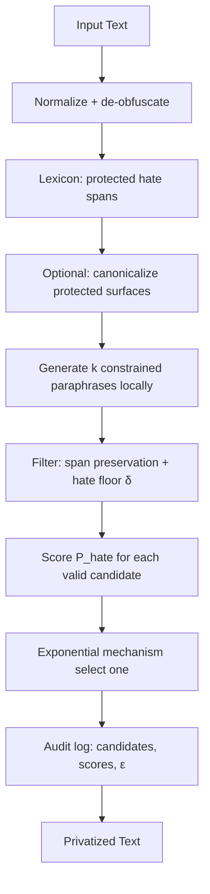

# EM-HSD: Layer-4-Only Proposal

**Constrained-Candidate Differential Privacy for Identity-Agnostic Hate Speech Detection**

Alternative submission track to the full [TRIAGE-DP](TRIAGE-DP.md) stack (Layers 1–5). This document proposes **sentence-level sanitization only**—applied to **every row**, not gated to hard posts—with minimal hyperparameters and efficient *k*-candidate generation.

---

## Executive summary

**EM-HSD** (Exponential-Mechanism Hate Speech Detection sanitization) privatizes text by:

1. **Normalizing** and **marking protected hate spans** (lexicon + optional light canonicalization)
2. **Generating k** locally constrained paraphrase candidates
3. **Filtering** candidates that drop hate utility or violate protected spans
4. **Selecting one** candidate via the **exponential mechanism** over hate-classifier utility scores (formal ε-DP on the selection step)

**Claim:** Identity-agnostic moderation corpora can be built with **formal DP at selection**, **HSD utility preserved by constraints**, and **far lower complexity** than token-level DP-MLM or full cross-saliency triage—if *k*-generation is implemented efficiently.

**Relation to full TRIAGE-DP:** Layers 1–3 (occlusion triage, Biber priors, large θ search) are **deferred or dropped**. Layer 4 becomes the **entire mechanism**. Layer 5 (rights framing) still applies unchanged—see [`layer-05-rights-architecture.md`](layer-05-rights-architecture.md).

---

## 1. Motivation

### 1.1 Why consider Layer-4-only?

| Full TRIAGE-DP (L1–L5) | Layer-4-only (EM-HSD) |
|------------------------|------------------------|
| O(n) occlusion probes per row | O(k) generation + O(k) scoring |
| Many hyperparameters (τ_H, τ_A, ε_Q*, Biber…) | **~4–6 knobs** |
| Hard/easy split + token + sentence paths | **One path for all rows** |
| Highest research novelty | **Fastest path to working submission** |
| Strongest mechanistic story | **Strongest execution story** |

Organizer case study shows **dpmlm** wins over Presidio and naive GPT, but dpmlm is **already their baseline**. EM-HSD differentiates by:

- **Sentence-level** holistic stylometric rewrite (phrase rhythm, openers, tics)
- **HSD-utility-scored** candidate pool (not generic paraphrase)
- **Formal DP on selection** (not naive LLM output)
- **Local processing only**

Case study lesson: GPT-4o mini (TO ≈ −0.36) failed because of **unconstrained prompting**. EM-HSD is the **structured fix**: constraints + utility scorer + exponential mechanism.

### 1.2 When this track is preferred

Choose EM-HSD as **primary** if:

- Engineering bandwidth favors **one clean pipeline** over occlusion infrastructure
- Dev set has **long or stylistically rich** posts where phrase-level change helps privacy
- Team can implement **constrained local proposer** quickly
- Goal is **reliable demo + TO competitive with dpmlm** with minimal tuning

Keep full TRIAGE-DP or a **hybrid** (canonicalize + EM-HSD) if short slur-heavy posts dominate and token-level hate protection is critical.

---

## 2. Problem formulation (unchanged from PrivHSD)

Maximize the hackathon trade-off:

```
TO = (Utility_protected / Utility_original) − (Privacy_protected / Privacy_original)
```

| Term | PrivHSD meaning |
|------|-----------------|
| Utility | Hate speech detection macro-F1 (higher better) |
| Privacy | Authorship re-ID top-1 accuracy (lower better after sanitization) |
| Constraint | Mechanism sees **Text only**—never `Author` or `HS` |

**IA-HSD** (identity-agnostic hate speech detection): sanitize for **stylometric privacy**, preserve **hate detection signal**.

---

## 3. Architecture

### 3.1 Pipeline (all rows)



**No hard-row gate.** Short benign posts and long hate posts use the same path; short posts simply get *k* near-duplicate candidates if the paraphraser makes minimal changes—EM still satisfies the formal selection claim.

### 3.2 Step-by-step

| Step | Component | Author-blind? | Formal DP? |
|------|-----------|---------------|------------|
| 0 | CSV wrapper passes `Text` only | Yes | — |
| 1 | Deterministic normalization (lowercase, de-elongate, de-leet for lexicon) | Yes | No (empirical) |
| 2 | Lexicon marks **protected spans** (must appear in output) | Yes | No |
| 3 | Optional canonicalize protected surfaces (`d00fus` → `dummy`) | Yes | No |
| 4 | Local generative model proposes **k** paraphrases with prompt constraints | Yes | No (generation) |
| 5 | Filter invalid candidates (§4.3) | Yes | No |
| 6 | Hate classifier scores each candidate | Yes | No |
| 7 | **Exponential mechanism** selects index *i* with prob ∝ exp(ε·u_i/(2Δ)) | Yes | **Yes (selection)** |
| 8 | Write output + JSONL audit log | Yes | — |

### 3.3 What we do not run

| Skipped | Reason |
|---------|--------|
| Layer 1 occlusion H(t), A(t) | Cost; replaced by lexicon + hate floor |
| Layer 2 Biber priors | Sentence rewrite targets register holistically |
| Layer 3 large θ search | Grid on {ε, k, δ} only |
| Token-level DP-MLM loop | Different granularity; optional future hybrid |
| External LLM APIs | Rights + case study |

---

## 4. Core components

### 4.1 Protected spans (lightweight utility guard)

**Purpose:** Prevent EM from selecting candidates that **neutralize hate** (case study GPT failure mode).

**Sources (in order):**

1. **Obfuscation-aware hate lexicon** (`mechanism/lexicon.py` — already in repo)
2. **Optional:** single-pass hate classifier flag if lexicon miss (no per-token occlusion)

**Protected span contract:** Each span’s **canonical skeleton** must appear in every **valid** candidate (case-insensitive, leet-normalized).

**Optional canonicalization before generation:**

- De-leet, de-space protected tokens → canonical surface
- Strips **author-specific spelling** while keeping **hate category** (mini Q1 from full TRIAGE-DP, ~zero occlusion cost)

### 4.2 Generative proposer

**Module target:** `stretch/generative_proposer.py`

**Requirements:**

| Requirement | Detail |
|-------------|--------|
| Local open-weight | FLAN-T5-base, Pegasus-paraphrase, or similar (pinned) |
| CPU viable | Hackathon reproducibility |
| k diverse outputs | See §5 cost reduction |

**Prompt skeleton:**

```
Rewrite the post below with different wording and style.
Rules:
- KEEP these terms/concepts unchanged in meaning: {protected_list}
- Do not remove insults or soften offensive content
- Change distinctive phrasing, openers, and stylistic tics
- Similar length (±25%)
Output only the rewritten post.

Post: {text}
```

### 4.3 Candidate filter

Reject candidate `c` if any check fails:

| Check | Rule |
|-------|------|
| **Span preservation** | Every protected canonical skeleton ⊆ `c` |
| **Hate floor** | `P_hate(c) ≥ P_hate(original) − δ` |
| **Length** | `0.4 ≤ len(c)/len(original) ≤ 2.5` |
| **Non-degenerate** | Normalized edit distance ≥ minimum vs original |

If **< 2** valid candidates: fallback strategies (§4.5).

### 4.4 Utility scorer

```
u_i = P_hate(c_i)
```

Use the same local hate classifier family as the evaluation harness utility probe (separate instance in `stretch/`, not imported from `harness/`).

Scores clipped to `[-C, C]` before EM (default `C = clip` from config, e.g. 5.0).

### 4.5 Exponential mechanism selection

Reuse `stretch/candidate_selection.py` → `dp.select`:

```
P(select c_i) ∝ exp(ε · clip(u_i) / (2 · 2C))
```

| ε | Effect |
|---|--------|
| **Higher ε** | Select higher-utility candidate (preserve HSD) |
| **Lower ε** | More random among valid candidates (stronger selection privacy) |

**Main dial** for operators: `ε` (plus optional preset levels 1–5).

### 4.6 Fallback policy

| Situation | Action |
|-----------|--------|
| 0 valid candidates | Output normalized + canonicalized text **without** EM; log warning |
| 1 valid candidate | Return it; log ε=N/A |
| Proposer failure | Same as 0 valid |
| All candidates identical | EM still valid; privacy from ε stochasticity if scores tie |

---

## 5. Efficient k-candidate generation

Layer-4-only is viable **only if** generation cost ≪ Layer 1 occlusion.

### 5.1 Target budget

| Post length | Target latency (CPU, small model) |
|-------------|-----------------------------------|
| ~30 tokens | 1–3 s |
| ~100 tokens | 3–8 s |
| ~200 tokens | 8–15 s |

### 5.2 Techniques

| Technique | Description |
|-----------|-------------|
| **Single-pass diverse decode** | One forward with `num_return_sequences=k`, `num_beams=k`, ` diversity_penalty` |
| **Small k** | Default **k=3** or **k=4**; ablate k=5 only on dev |
| **Batch scoring** | Stack k candidates → one hate-classifier forward pass |
| **Early filter** | Regex/lexicon reject before classifier |
| **Cache normalized text** | Normalize once per row |
| **Skip generation on empty/trivial** | Identity passthrough with log (edge case) |

### 5.3 What not to do

- k serial API calls to closed models
- k independent full autoregressive runs without batching
- Scoring before cheap span-preservation filter

---

## 6. Hyperparameters

### 6.1 Full list (small)

```yaml
em_hsd:
  k: 4                      # candidates to generate
  epsilon: 18.0             # EM selection dial (higher = more utility)
  clip: 5.0                 # score clip for sensitivity
  hate_floor_delta: 0.05    # max allowed P_hate drop vs original
  temperature: 0.9          # generation diversity
  min_edit_ratio: 0.08      # reject candidates too similar to original

lexicon:
  enabled: true
  path: data/lexicons/hate_terms.txt

generation:
  model: google/flan-t5-base  # pinned; local only
  max_new_tokens: 256

normalization:
  # same flags as SPINE default.yaml
```

**Tunable in practice:** `epsilon`, `k`, `hate_floor_delta` — **3-dimensional grid** on dev.

### 6.2 User-facing privacy dial

| Level | ε | δ | Intent |
|-------|---|---|--------|
| 1 Utility-first | 35–50 | 0.02 | Max HSD preservation |
| 2 | 25–35 | 0.05 | |
| 3 **Default** | 15–25 | 0.05 | Balance |
| 4 | 8–15 | 0.08 | |
| 5 Privacy-first | 3–8 | 0.10 | Max re-ID reduction |

Calibrate on dev with holdout; map levels to grid points.

### 6.3 Comparison to full TRIAGE-DP θ

| Parameter | EM-HSD | Full TRIAGE-DP |
|-----------|--------|----------------|
| τ_H, τ_A | — | Yes |
| ε_Q1, ε_Q2, ε_sentence | **ε only** | Multiple |
| Biber boosts | — | Yes |
| Occlusion thresholds | — | Yes |
| k | Yes | Yes (hard rows) |
| clip | Yes | Yes |
| hate_floor δ | Yes | Via H(t) routing |

---

## 7. Privacy claim (narrow and exact)

Same honesty standard as SPINE / DP-MLM:

**We claim:**

- The **exponential-mechanism selection** among k candidates satisfies **ε-DP** with respect to the clipped utility score vector (Meisenbacher / McSherry-Talwar construction; implemented in `mechanism/dp.py`).

**We do not claim:**

- DP on **generative decoding** (sampling paraphrases is not ε-DP in v1)
- **Document-level** end-to-end DP
- Normalization, lexicon marking, or canonicalization are **empirical obfuscation** without formal ε

**Composition:** One ε per row for selection step; report in audit log. Token-level ε absent in this track.

---

## 8. Audit log

Per row (JSONL):

```json
{
  "mode": "em-hsd",
  "epsilon": 18.0,
  "k_requested": 4,
  "k_valid": 3,
  "protected_spans": ["dummy", "moron"],
  "P_hate_original": 0.91,
  "candidates": [
    {"text_hash": "a1b2...", "P_hate": 0.89, "valid": true},
    {"text_hash": "c3d4...", "P_hate": 0.42, "valid": false, "reject": "hate_floor"},
    {"text_hash": "e5f6...", "P_hate": 0.87, "valid": true}
  ],
  "selected_index": 0,
  "selection_probs": [0.72, 0.09, 0.19],
  "fallback": false
}
```

Demo: show side-by-side **original → 3 candidates → selected** with scores.

---

## 9. Evaluation against PrivHSD criteria

### 9.1 Problem understanding

| Question | EM-HSD answer |
|----------|---------------|
| Privacy–HSD tension understood? | Yes: utility = hate score in candidate pool; privacy = stylometric rewrite + EM |
| Grounded in literature? | PrivRewrite (candidates + EM), DP-MLM (EM math), case study (naive LLM fails) |
| Novel vs dpmlm? | **Sentence-level task-conditioned selection** vs uniform token DP |

**Risk:** Appears as “paraphrase model” without write-up → mitigate with formal EM section and constraint ablation.

### 9.2 Human rights–centered innovation

| Question | EM-HSD answer |
|----------|---------------|
| Privacy + HSD together? | Hate floor δ + protected spans + utility-weighted selection |
| Human-centered? | **Privacy dial (1–5)**; simple pipeline explanation |
| Understandable? | “We generate k versions, keep hate signal, DP picks one” |
| Accountability | Candidate-level audit log |

**Risk:** Dialect erasure by paraphraser → document in limitations; optional dialect-preserving prompt variant.

### 9.3 Execution and feasibility

| Question | EM-HSD answer |
|----------|---------------|
| Works? | Scaffold EM done; proposer is main build |
| Favorable TO? | **Must validate vs dpmlm** on dev |
| Open / reusable? | Extends `Johnny t0-1.03` stretch layer; local models |
| Non-functional? | CPU path; pinned deps |

**Strength:** Best criterion for this track.

### 9.4 Impact and alignment

| Question | EM-HSD answer |
|----------|---------------|
| Societal need? | Shareable moderation datasets without stylometric fingerprints |
| Limitations? | Generation not DP; lexicon gaps; English |
| Follow-ups? | Hybrid with Layer 1; adaptive k; fairness audits |

**Risk:** Publication novelty lower than dual-saliency TRIAGE-DP—position as **efficient IA-HSD deployment model**.

---

## 10. Experimental plan

### 10.1 Baselines

1. Identity (no sanitization)
2. **dpmlm uniform** (organizer reference)
3. Presidio / PII (negative)
4. Naive local paraphrase **without** EM or constraints ( reproduce GPT failure)
5. **EM-HSD full**
6. *(Optional)* SPINE or full TRIAGE-DP for upper bound

### 10.2 Ablations (EM-HSD-specific)

| Ablation | Tests |
|----------|-------|
| No protected spans | Utility collapse |
| No hate floor δ | Utility collapse |
| No EM (pick max score) | Privacy collapse |
| k=1 | No selection DP |
| No canonicalization | Identity + utility on obfuscated slurs |

### 10.3 Metrics

| Metric | Source |
|--------|--------|
| **TO** | Primary |
| Utility macro-F1 | Harness |
| Re-ID accuracy | Harness |
| Valid candidate rate | EM-HSD diagnostic |
| Latency per row | Feasibility |
| Burrows' Delta (subset) | Stylometric privacy (optional) |

### 10.4 Success criteria (internal)

| Outcome | Interpretation |
|---------|----------------|
| TO > dpmlm on dev holdout | **Strong submission** |
| TO ≈ dpmlm within 0.05 | Competitive with simpler story |
| TO < dpmlm | Add canonicalization-only hybrid or partial Layer 1 |

### 10.5 Hypothesis

Holistic constrained paraphrase + EM beats token-level dpmlm when **phrase-level stylometry** dominates privacy leakage and **hate signal is span-local** (lexicon + δ sufficient).

---

## 11. Implementation plan

### 11.1 Repo mapping

| Task | Path | Status |
|------|------|--------|
| EM selection | `stretch/candidate_selection.py` | Done |
| Config schema | `configs/em-hsd.yaml` | To add |
| Generative proposer | `stretch/generative_proposer.py` | **To build** |
| Span filter + hate floor | `stretch/constraints.py` | To build |
| Hate scorer | `stretch/utility_scorer.py` | To build |
| Orchestrator | `stretch/em_hsd.py` or `mechanism/em_hsd.py` | To build |
| CLI mode | `wrapper/run.py --mode em-hsd` | To add |
| Calibrate grid | `harness/calibrate_em.py` | To add (simple grid) |
| Tests | `tests/test_em_hsd.py` | To add |

### 11.2 Minimal viable path (engineering order)

1. **Constraints + scorer** on hand-written candidate strings (unit tests)
2. **Wire EM selection** end-to-end on synthetic CSV
3. **Integrate FLAN-T5** proposer with batched k decode
4. **Lexicon protected spans** from existing setup script
5. **Grid calibrate** ε, k, δ on dev
6. **Research note + demo** (Layer 5 framing)

### 11.3 Quickstart (target)

```bash
pip install -r requirements.txt -r requirements-hf.txt
pip install -e .
python scripts/setup_models.py
python scripts/setup_lexicons.py

python -m wrapper.run --in dev.csv --out dev_private.csv \
    --mode em-hsd --config configs/em-hsd.yaml

python -m harness.evaluate --original dev.csv --privatized dev_private.csv \
    --config configs/em-hsd.yaml --utility-backend hf

python -m harness.calibrate_em --dev dev.csv \
    --config configs/em-hsd.yaml --output configs/em-hsd-calibrated.yaml
```

---

## 12. Hybrid escape hatch (if TO lags)

If EM-HSD alone underperforms on **short hate posts**, add **one** cheap Layer-1 fragment—without full occlusion:

```
normalize → lexicon canonicalize protected spans → EM-HSD (k + EM)
```

No τ_H, τ_A, Biber, or per-token DP. Often recovers utility on obfuscated slurs at negligible cost.

Do **not** expand to full TRIAGE-DP unless dev proves necessary—preserve the simplicity story.

---

## 13. Positioning vs alternatives

| Method | EM-HSD differentiation |
|--------|------------------------|
| **dpmlm** (organizer) | Sentence holistic rewrite; HSD-scored pool; fewer ε knobs at token level |
| **GPT-4o naive** | Constraints + hate floor + formal EM |
| **PrivRewrite** | Local only; hate utility; protected spans |
| **Full TRIAGE-DP** | Faster, simpler; trade research depth for execution |
| **Presidio** | Stylometry threat model |

**Suggested public name:** **EM-HSD** or **CCDP-HSD** (Constrained-Candidate DP for HSD).

---

## 14. Research note outline (EM-HSD track)

1. Introduction — IA-HSD; why naive LLM paraphrase fails (case study)
2. Threat model — stylometry re-ID + HSD utility
3. Method — k candidates, constraints, exponential mechanism (diagram §3.1)
4. Privacy claim — narrow (§7)
5. Rights architecture — from Layer 5 doc (abbreviated)
6. Experiments — baselines + ablations (§10)
7. Limitations — generation not DP; dialect; lexicon
8. Conclusion — moderation without stylometric surveillance tooling

Target: 4–6 pages.

---

## 15. Limitations

- Generative step not differentially private
- Utility guard relies on lexicon + classifier—not occlusion-level precision
- Paraphraser may homogenize register or dialect
- k and prompt design strongly affect TO
- English Reddit-style text assumed
- Local TO ≠ organizer hidden evaluator
- Short texts may receive unnecessary paraphrase (mitigate: min_edit_ratio + identity fallback if all candidates too similar)

---

## 16. References

| Reference | Role |
|-----------|------|
| Meisenbacher et al., **DP-MLM** | Exponential mechanism math |
| Kim, **PrivRewrite** | Candidates + EM structure |
| Organizer **case study** | dpmlm vs Presidio vs GPT |
| Loiseau et al., **Adaptive Text Anonymization** | Task-conditioned utility |
| [`layer-04-sentence-level-em.md`](layer-04-sentence-level-em.md) | Component detail (hard-row variant) |
| [`layer-05-rights-architecture.md`](layer-05-rights-architecture.md) | Evaluation criteria / CoE |
| [TRIAGE-DP.md](TRIAGE-DP.md) | Full stack alternative |
| `Johnny t0-1.03/src/stretch/candidate_selection.py` | Existing scaffold |

---

## 17. Decision summary

| Criterion | EM-HSD (Layer-4-only) | Full TRIAGE-DP |
|-----------|----------------------|----------------|
| Problem understanding | B+ | A |
| Human rights–centered | A− | A |
| **Execution & feasibility** | **A** | B+ |
| Impact & novelty | B+ | A− |
| Time to ship | **Shorter** | Longer |
| Beat dpmlm | Empirical | Likely |

**Recommendation:** Run EM-HSD as **parallel primary track** until dev holdout TO is measured. Ship whichever wins; use hybrid canonicalization if EM-HSD is close but loses on obfuscated slurs.
